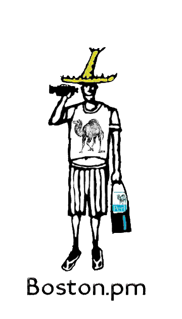

% History Annals
% Boston Perl Mongers {#logo.float_r width=30% }
  Ronald J Kimball & Bill Ricker
% 1998-2023

Boston Perl Mongers history is divided into three parts, like Gaul.

[Key Highlights (annals)](History-00.html) ***this file***

* [Reconstructed Ancient History 1999-2004](History-01-Reconstructed-1999.html)
* [Mid History 2004-2016](History-02-Calendar.html)
* [Recent History 2017-present](History-03-Email.html)

(*Note. This file is in chronological order, most recent at the bottom.
All start with a table of contents by year.*)

| When        | | What Happened                                     |
|:------------|-|---------------------------------------------------|
| 1998-01-30  | | Boston.pm founded by **Chris Nandor** |
| 1998-02-01  | | Discussion list created |
| 1998-09-??  | | Meeting at MIT with **Randal Schwartz** |
| 1998-10-??  | | First of many social meetings at **Elaine Ashton**'s house |
| 1999-01-25  | | First regular tech meeting, held in **Uri Guttman**'s attic |
| 1999-03  | |    **Ronald Kimball** takes over as leader of Boston.pm |
| 1999-04-27  | | Boston.pm hosts a party during O'Reilly's Perl Tutorials in Boston |
| 1999-06-07  | | **Cambridge.pm** is founded – we're still not sure why :) |
| 1999-09  | |    **Uri Guttman** holds a haiku contest on the list; Phil Johnson, J Proctor, & John Saylor win books |
| 1999-10-20  | | Discussion list moved to **hfb.pm.org** |
| 1999-12-05  | | Boston.pm paintball outing |
| 2000-02-07  | | Last regular tech meeting in Uri's attic |
| 2000-02-19  | | Jeff Burke covers a social meeting at Elaine Ashton's house for **digitalmass.com** (*alas rolled off front page before [first Archive.org snapshot](https://web.archive.org/web/20000302010431/http://www.digitalmass.com/)* |
| 2000-03-06  | | First regular tech meeting at **Focalex, Inc.** |
| 2000-04-01  | | Boston.pm sells shirts & hats and gives out camel-shaped cookies at the Geek Pride Festival |
| 2000-08-26  | | Elaine Ashton serves cold Guinness at a party; the list erupts in flames |
| 2000-09-01  | | Job posting policy for the discussion list instituted |
| 2000-11-05  | | Tech meeting with MySQL's **Monty Widenius;** at **NuSphere**, Bedford (corp Shuttle bus!) **NuSphere** permanently loans a projector to Boston.pm |
| 2001-01-17  | | Last regular tech meeting at **Focalex, Inc.** |
| 2001-02-13  | | First regular tech meeting at **Boston.com** |
| 2001-03-06  | | Discussion list moved to **pm.org** |
| 2001-07-08  | | Social with **Damian Conway** and **Michael Schewern** at Uri's |
| 2001-07-09  | | Tech meeting with **Damian Conway** during his first ever trip to Boston |
| 2002-01-18  | | Boston.pm has a team in the **MIT Mystery Hunt** (merges with team *Austerity Nymph*) |
| 2002-09-03  | | Discussion list moved to **mailman** from **majordomo**; Announcement list created |
| 2002-10-xx  | | Boston.PM listing added to [Boston User Group Calendaer](http://www.bugc.org/) and www(.)BostonUserGroups(.)com |
| 2004-01-13 | | Last regular tech meeting at **Boston.com** |
| 2004-03 | | Ronald's **5th Anniversary** as Facilitator goes unrecognized since no meeting. ***Yeah Ronald!*** |
| 2004-04-27 | | First regular tech meeting at **Boston University** |
| 2004-05-04 | | Social meeting with **Randal Schwartz and Tad McClellan** |
| 2004-09-22 | | **Boston.PM.org** **Kwiki** set up during a tech meeting at **Akamai/Novell,** followed by Social meeting with **Randal Schwartz** in Cambridge (CBC)|
| 2004-09-28 | | Social meeting with **Randal Schwartz** at Legal Seafood, Framingham (*pattern?*) |
| 2004-10-02 | | Our own **Dan Sugalski** presents Perl 6 to **GBC-ACM Seminar Series** (for $$) |
| 2004-12-14 | | Tech meeting downshifts to Social, **BBW**. |
| 2005-01 | | **Boston.pm.org** web site moves to hosting provided by Sean P. Quinlan |
| 2005-01-19 | | Social Meeting at **Fire & Ice** Harvard Square with **Ben Tilly** |
| 2005-02-10 | | Social Meeting at **Cheesecake Factory** Cambridgeside with **brian d foy** |
| 2005-04-12 | | Last regular tech meeting at **Boston University** |
| 2005-08-09 | | First regular tech meeting at **MIT** |
| 2005-0x-xx | | Boston.PM's own [Jarred 'pthbb' Pierce](http://pthbb.org/) agrees to be first interregnum editor of [PerlAdvent.org](https://perladvent.org/), with Boston.PM's help. |
| 2005-10-26 | | Tech Meeting with **Damian Conway** and his **Small Miracles** talk |
| 2005-12-xx | | [PerlAdvent.org YAP(A)C 2005](https://perladvent.org/2005/), Jarred & Boston's first.|
| 2006-04-28 | | Social meeting with **brian d foy** - *Jasper White's Summer Shack(R)(tm)(sm)* |
| 2006-09-25 | | **Damian Conway**'s [Open Talk 2.0 & Da Vinci Codebase talk](Damian2006Mementos.html) with the *Best Friends Cocoa* *Buffalo Memorial* Foil Hat Contest as intermission entertainment |
| 2006-12-xx | | [PerlAdvent.org 2006](https://perladvent.org/2006/), Jarred & Boston's second.|
| 2007-06-12 | | [**CIDC** Cambridge Interactive Development Corporation](http://www.cidc.com) began sponsoring tech meetings, thru 2008; Sean Q was hiring. |
| 2007-11-13 | | Social at **Boston Beer Works**; **JohnGalt Staffing** bought a round! | 
| 2007-12-xx | | [PerlAdvent.org 2007](https://perladvent.org/2007/), Jarred & Boston's third.|
| 2008-06-24 | | **Bill Ricker** takes over as leader of Boston.pm. Thanks to **Ronald** for 9 great years. |
| 2008-07-08 | | Social at **Sunset Bar + Grill**  |
| 2008-12-09 | | Social meeting **RedBones** in Davis Square |
| 2008-12-xx | | [PerlAdvent.org 2008](https://perladvent.org/2008/), Jarred & Boston's fourth.|
| 2009-03-31 2009-04-01 | | BPM publicizes **Larry Wall** presenting *"Ballistic Programming"* to [HCS](https://lists.hcs.harvard.edu/pipermail/hcs-announce/2009-March/thread.html#327) and [MIT SIPB](https://sipb.mit.edu/projects/talks/2009/larry_wall/) on adjacent days on his world tour *"an unedited version of the history of Perl, its current development and much wit and panache."* |
| 2009-12-xx | | [PerlAdvent.org 2009](https://perladvent.org/2009/), Jarred & Boston's fifth.|
| 2010-12-xx | | [PerlAdvent.org 2010](https://perladvent.org/2010/), Jarred Pierce's & Boston's sixth and last; Mark Fowler resumes as Editor in 2011.|
| 2011-10-11 | | CIDC sponsors one meeting, presentation by Sean Quinlan |
| 2013-06-xx | | No one notices **Bill Ricker**'s 5th anniversary either. |
| 2013-08-xx | | Social at **CBC**  |
| 2013-09-11 | | **Boston.PM.org** moves from Kwiki to Wikispaces, shortly before the kwiki's 9th birthday. *This ends the spam pollution.* |
| 2014-12-09 | | *Stirring the Hive with a Perl Stick: Hadoop with Perl - Charles Hardin* a **Suburban Meeting** @ [**EIG Burlington**](https://en.wikipedia.org/wiki/Newfold_Digital), c/o longtime member Sean Quinlan | 
| 2015-05-12 | | Emergency Social in lieu of tech topic, **blue shirt** in lieu of RedBones |
| 2015-10-11 | | Social for **Ronald Kimball,** former Boston.PM facilitator/leader, removing to the upper mid-west. |
| 2015-12 | | [The Perl Shop](https://theperlshop.com) begins sponsoring meetings, courtesy of long-time Boston.PM member Tom Metro. |
| 2017-05-04 | | **May the Fourth** cookout Social at **Uri G**'s, with **Randal Schwartz** |
| 2017-06    | | **MIT** declares Parking Alert |
| 2018-06-xx | | No one notices Bill Ricker's **10th anniversary,** *we've got a trend!* |
| 2018-08+09 | | **Wikispaces** pivots business model to courseware; FLOSS project wikis no longer free, so **Boston.PM.org** moves to **QualityBox.us** demo multi-tenant wiki |
| 2018-10-09 | | **Mark Fowler**, *"Perl Advent Calendar Redux"* a **Suburban Meeting** hosted by [**MaxMind**](https://www.maxmind.com) in Waltham, while Mark was visiting their local office. |
| 2018-10    | | **MIT** lifts Parking Alert (for visitors after 5pm at E51) |
| 2018-11    | | **Jason Crome** (of Dancer project) starts **Charlotte (NC) Perl Mongers**. |
| 2020-03-09 | | **MIT announces COVID19 Lockdown** [archived](https://web.archive.org/web/20210316072924/https://news.mit.edu/2020/events-postponed-canceled-covid-19-0309) |
| 2021-04-28 | | **first joint Boston + Charlotte PM** virtual meeting. |
| 2022-02    | | **QualityBox.us** folds, **Boston.PM.org** wiki eventually falls unresponsive |
| 2022-08-19 | | **MIT** [announces](https://twitter.com/realBurhanAzeem/status/1560730305660538880) open campus will not return, locked is the new normal. |
| 2022-09 | | **Boston.PM.org** redirects to bostonpm.github.io/ , now produced as markdown -> static html offline |
