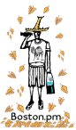

% Reconstructed History (1999-2004)
% Boston Perl Mongers   {#logo .float_r width=30% }
  from posts of: Ronald J Kimball, Uri Guttman, Elaine HFB, _etc_. 
% 1999-2004

Boston Perl Mongers history is divided into three parts, like Gaul.

[Key Highlights (annals)](History-00.html)

* [Reconstructed Ancient History 1999-2004](History-01-Reconstructed-1999.html) ***this file***
* [Mid History 2004-2016](History-02-Calendar.html)
* [Recent History 2017-present](History-03-Email.html)

(*Note. This file is in **Reverse** chronological order, most recent at the top.
All start with a table of contents by year.*)

Extracted 1999-Oct to 2004-Sep from mailing list archives, public and Private. 
[Public Archive](https://www.mail-archive.com/boston-pm-announce@mail.pm.org/thrd3.html)

# The Boston University era 2004-04-27 - 2005-04-12 

Sean Quinlan and other BU staff arranged for classroom use in BU Kenmore building.
Second Tuesdays only if no Red Sox Home Game, we had to be flexible.

(*The BU Era continues up into/down from Mid History; the file break is because because Mid History is history from the Wiki Era.*)

# 2004

##Tech Meeting Tuesday, August 3 

We'll have two presentations at tomorrow's meeting.

**Ian Langworth** will be giving a talk on [**Kwiki**](https://metacpan.org/pod/Kwiki), a Wiki environment written in Perl.  
This will be an updated version of his talk from YAPC.

(*Narrator: This talk was the inspiration for Boston.PM getting it's on kWiki. 
And that kWiki provided a separate history. **END OF AN ERA***)

Also, **Uri Guttman** will give a talk on **Parallel Sessions in Perl.**
Although I did not see this talk when Uri presented it at OSCON last week, 
my understanding is that it is *not* entirely about Stem.

In addition, we'll hear about our own **Dan Sugalski getting hit in the face with a pie**
and other goings on at OSCON.

## Tech Meeting w/ Damian Conway, Tuesday, July 13 

**Damian Conway** will be giving his [**Everyday Perl**]() presentation at tonight's
meeting.  [http://damian.conway.org/Seminars/Everyday.html 404-archived]()
To allow him more time, we'll be starting at 7pm (instead of the usual
7:30pm).

**Greg London,** longtime Boston.pm member and author of ***Impatient Perl***, will
be sponsoring refreshments at tonight's meeting.  At my suggestion, Greg
will be providing cookies, pretzels, and other snacks.  Please make your
own arrangements for dinner.

>  "Impatient Perl" => A GNU-FDL training manual for the hyperactive
Free HTML/PDF downloads at <http://greglondon.com/iperl>
paperback/coil-bound available for $8.50+s&h
`[GNU-FDL = GNU Free Document License]`

If you'd like to help decide which talk we'll ask Damian to give, check out
the list at <http://damian.conway.org/Seminars/> and then post to the
discussion list or send your choice to me.  I recommend a vote for one of
the following talks: Everyday Perl, Sufficiently Advanced Technologies,
Time::Space::Continuum.

The pizza and beverage fund needs a (corporate) sponsor.

(*Damian now presents updated [**Everyday Raku**](http://damian.conway.org/Seminars/EverydayRaku.html) - Bill 2022*)

## Tech Meeting Monday, June 14 

**Greg London** showed off his new book, **Impatient Perl,** "a Perl training
manual for the hyperactive programmer", and gave out review copies.
<http://www.greglondon.com/> has more info, as well as HTML and PDF versions
of the book, and a link to the print-on-demand publisher lulu.com from
which you can purchase a nice bound hard copy of the book.

I showed a short web script I've written for users of
<http://www.ricochetrobot.com/> , which is an online version of the Ricochet
Robot board game.  If you enjoy board games and puzzles, check out the
site!

Ken highlighted some interesting Perl code in a project he's working on,
leading to a discussion on methods for securely storing credit card data.

We also discussed Tim Kohl's templating needs and Chris Devers's DBM needs.

Afterwards, we went to Boston Beer Works, where we talked about board games
and puzzles, the upcoming remake of Willy Wonka and the Chocolate Factory,
30-foot-tall houses of cards, and digital photography.

Many thanks to Ken for going to get his laptop in the middle of the
meeting, and to Tim for being the BU liaison this time around.

## Tech Meeting Tues, May 18 

**Uri** will be giving his full presentation on 
[**Sort::Maker**](https://metacpan.org/pod/Sort::Maker), 
a module that makes it easy to create powerful and efficient sorting functions.

## May 11 - 2d Tues meeting moved because Red Sox Home Game

This meeting will put us onto our new schedule of the second Tuesday of
every month, except when this would conflict with a Red Sox home game.

## Tech Meeting Tues, April 27

Yes, Virginia, there is a tech meeting!  Next Tuesday, April 27, we will
have a meeting at Boston University, Kenmore Classroom Building, 565 Commonwealth Ave.

This will be our first meeting at BU; if it works out we may have future
meetings there as well.

The format for this meeting will be a series of short talks.  (Like
lightning talks, but not necessarily limited to 5 minutes. :)  So far, 
**Uri Guttman, Greg London, and Sean Quinlan** will each be speaking about projects
they're working on.  I'll (*Ronald Kimball*) also be looking for an interesting obfuscation to
present for our amusement and/or bemusement.

If you're interested in giving a short presentation at this meeting (or a
longer presentation at a future meeting), please let me know.

Thanks to **Sean Quinlan** for securing the meeting space for us!

# The Boston.com era 2001-02-13 - 2004-01-13

Boston.com, the Boston Globe online property, used Perl for their feeds in and out, and was happy to sponsor Boston.pm at their Seaport / Fort-Point-Channel district offices.
A couple sheets of plywood converted the pool table into a casual conference table for (sponsored) Pizza.

## January 13th, 2004 - Dan Sugalski - Parrot

[**Dan Sugalski**](https://en.wikipedia.org/wiki/Dan_Sugalski) (*former Boston.pm local, Perl 5 core dev and chief architect for Perl 6 Parrot VM *)
will be presenting a tutorial on Parrot.  
Here is his description of the talk:

The talk is a run-through of an Introduction to Parrot tutorial
session I'm giving at the NordU conference later in January. It's a
three hour (more or less) introduction to parrot, covering some
history, the reasons and driving principles, and the basic
architecture. There'll be some demo programs, including a demo of my
current work project (a compiler for an old 4GL with integrated
screen and DB handling--the demo program is a screen-based DB data
editor that's entirely in parrot)

(*The [Parrot](http://www.parrot.org/) VM was one of the original Perl 6 platforms.*)
(*Dan was a co-author of  _Perl 6 Essentials_ (ISBN:[0-596-00499-0](https://isbn.nu/0-596-00499-0), Allison Randal, Dan Sugalski, Leopold Tötsch, 2003: O’Reilly & Associates.*)

Also, **Darren Chamberlain** will be giving away a copy of his new O'Reilly
book, _Perl Template Toolkit_.  <http://www.oreilly.com/catalog/perltt/>

**END OF AN ERA - Last Tech Meeting at Boston.com**

# 2003

## Social Meeting Mon, Dec 29 - John Harvard's (brewpub) Harvard Sq.

## Tech Meeting Tues, Dec 9 

**Uri Guttman** will be giving a short talk on his **File::Slurp** module, which
provides a convenient way to read in an entire file.

**Bill Ricker** will discuss solving word puzzles with Perl one-liners, such as
the RN puzzle from Nov 23 at <http://www.npr.org/programs/wesun/puzzle/> .

Free review copies of three new books from O'Reilly: one each of the
_Perl Cookbook_ 2nd edition, _Learning Perl Objects, References, and
Modules_, and the _Regular Expression Pocket Reference_.  These will be
given out on the condition of writing and posting a review.

(Another presentation to be determined.
Perhaps you have a neat script you've written, or a favorite CPAN module
you want to evangelize, or an obfuscation to stump us with.)
  

## Tech Meeting Tues, Sep 30 w/ Damian Conway - Perligata

Damian Conway will be giving his infamous [Perligata](http://damian.conway.org/Seminars/Perligata.html) talk.  
Learn how to program Perl in Latin!

[CPAN Lingua::Romana::Perligata](https://metacpan.org/dist/Lingua-Romana-Perligata/view/lib/Lingua/Romana/Perligata.pm)

## Tech Meeting Tues, August 19 - Parrot

**Ronald J Kimball** will be presenting an exclusive look at 
(*former Boston.PM local*) **Dan Sugalski's** recent research in
**Parrot development**.  
(*The [Parrot](http://www.parrot.org/) VM was one of the original Perl 6 platforms.*)

We may hear from **Kenneth Graves** on his plan to port
CLU to Parrot.  

I'll also find an interesting [JAPH](https://en.wikipedia.org/wiki/Just_another_Perl_hacker) 
or obfuscation for us to dissect.

Also, **O'Reilly** recently sent us a review copy of two different books, which
I will give out at the meeting to Mongers who agree to write reviews in
exchange.  (Sorry, I don't have the books at hand; you'll just have to come
to the meeting to find out the titles!)

## Tech Meeting Tues, June 10 - Kevin Falcone - AxKit

**Kevin Falcone** will be giving a talk on **AxKit**:

  AxKit - Moving beyond static content with taglibs and providers
  
  When developers start working with AxKit, their first thoughts are
  creating static XML pages and rejoicing in the separation of content
  and display that the stylesheet pipeline provides.  However, once
  developers move beyond simple websites, AxKit provides two ways to aid
  in the generation of dynamic content.  Taglibs provide custom tagsets
  for use in your pages, while providers are used to create modules that
  work like mod_perl handlers.  This talk will compare and contrast
  these two approaches to dynamic content and provide examples of when
  each would be most useful for a site.

If you are speaking at YAPC or TPC, and would like to present your talk at
this meeting, please let me know.

## Social Meeting Wed March 26th w/ Schuyler Erle - CBC

**Schuyler Erle** is in Boston this week on business for **O'Reilly** (*Perl etc publisher*), 
and he'd like to hang out with us!  We'll be getting together tomorrow night
(Wednesday, March 26) at the Cambridge Brewing Company in Kendall Square,
Cambridge.  7pm to Whenever.

## Social Meeting Thursday, March 6 BBW Fenway

Boston Beer Works

## Tech Meeting, Jan 21 - Damian Conway 

**Damian Conway** will be talking on [***Life, the Universe, and Everything!***](http://damian.conway.org/Seminars/Life.html)

Thanks to **Uri Guttman** for acting as Damian's liaison.

# 2002

## December 10, 2002 

We should be getting a demo of the new Mac::Carbon module from **Chris Nandor**.  
After that, we may head to a nearby social environment.  
Come to tomorrow's tech meeting, where *you* can decide what happens!

Hosted at offices of Boston.com in Seaport/Fort-Point-Channel District.

Pizza and refreshments will be provided by Boston.com.

## November 21 - Social meeting, Village Smokehouse, Brookline Village

## Weds, October 23 - Tech Meeting 

Due to scheduling conflicts, there will not be a Tech Meeting this week or
next.  Instead, the Tech Meeting will be on Wednesday, October 23.  This is
later in the month than usual, but it was the most workable date for myself
and our hosts at Boston.com.

**Uri Guttman** will be presenting "A [Stem](https://metacpan.org/dist/Stem) Cell Cookbook".  This talk will
cover how easy it is to create working Stem Cells and how to incrementally
add features to make them more powerful.

**Jim Freeman** will be presenting "A New Kind Of Module".

## Tech Meeting Tues, Sep 17

**Uri** has arranged a couple lightning talks for us.  
I (***Ronald J Kimball***) will be giving a lightning talk on my proposal for a new syntax for `L<>` in POD, and I believe Uri will be giving a lightning talk entitled "the 'instant' Stem
cookbook".

**Greg London** will give a half hour talk on his new module, **EasyArgs**, which
makes using command line arguments easier.

This leaves us with time for one more mid-length talk.  Let me know if you
have something you'd like to present (whether it's a module, a script, an
obfuscation, whatever), or a topic you'd like to have people discuss at the
meeting.

Also, I will be giving out a review copy of two new O'Reilly books (which
arrived the day after last month's meeting :/ ), _Mastering Regular
Expressions_ 2nd Ed and _Perl and LWP_.

## Tech Meeting Tues, Aug 13 

**Federico Lucifredi** will be giving a talk on Perl`<->`Qt Bindings.  Here's
Federico's abstract for his talk:

>  The PerlQT bindings enable developers to create graphic applications in
the scripting language of choice within the OpenSource movement. The
author will initially cover all the Qt basics necessary to understand how
GUI programming is done 'the Qt way' as well as Perl module programming
fundamentals. After reviewing what changes in the Perl bindings we will
then proceed to simultaneously review PerlQt and C++/Qt code showing the
same functionality. This will conclude the presentation by highlighting
the shortcomings of the currently available release of the bindings while
at the same time providing a real world example of their use.

Additionally, **Uri** has arranged a lightning talk to begin the meeting.
**Jerrad Pierce** will give a short talk on his [figlet module](https://metacpan.org/dist/Text-FIGlet).  **FIGlet** is a
program for drawing text in fancy ASCII letters.  <http://www.figlet.org>

##  Damian Conway Classes July 1-3

monday-wednesday, july 1-3, are the 3 days of classes Damian will be
teaching. the location is now set and it will be in Davis sq. i will
mail directions to the registrants. remember, that students and the
currently unemployed can take any or all of the classes at 50% off!
more info can be found at <http://stemsystems.com/class/>

uri

## Damian Conway - Special Tech Meeting Monday July 1

  Our next tech meeting will be Monday, July 1, with Damian
Conway!  Damian will be giving his infamous [Extreme Perl](http://damian.conway.org/Seminars/Extreme.html) talk.  
This meeting will be free and open to anyone who wants to attend.
Pizza and refreshments will be provided by Boston.com.
 - Ronald

monday July 1 at 7pm is Damian's free lecture to Boston.pm. it will be
at the usual meeting place in Boston.com's place. Damian will be talking
about extreme perl. pizza and drinks will be generously provided by
Boston.com.

uri

(*Full title is "Extreme Perl -- The Horror That Is SelfGOL".*)

## Sunday June 30th, Damian Conway Social 

Sunday June 30 at 3pm is the Boston.pm social.  food (from
blueribbonbbq.com including veggie side dishes and salad) and beverages
are FREE!! and you are welcome to bring your own food. we will have a
grill to use.  i need RSVP's ASAP!! so far only 2 of you have said you
are coming.  that is ridiculous for free BBQ and beer. so reply now or
lose out.  i will email directions to my place soon.

uri

## Tech Meeting Tues, June 11 

This is great opportunity for people who will be presenting at YAPC to try
out their presentations and get feedback.  Please email me if you would
like to give your YAPC talk at the tech meeting.

**Kevin Falcone** will be presenting on **Mod_Parrot**: embedding and extending the
parrot virtual machine.  This talk will demonstrate the use of Parrot's
current embedding interface, and how to create a custom PMC to communicate
with an external library.

## Tech Meeting Tues, May 14

Andrew Langmead will give a presentation on the integration of Perl and
Zope.

## Tech Meeting, Tues, Apr 23

There's no formal presentation scheduled for this meeting, but I'll work on
one or two things to present.  Also, if you have a piece of code you'd like
reviewed, this could be a good opportunity.

I presented cryptosolve.pl, a program I'd written
that solves basic cryptograms.

The program (and a bunch of input files) are now available at
http://thayer.dartmouth.edu/~rjk/perlwords/ (*404; modern URL:*)
<https://www.tamias.net/rjk/perl/words/>

Download it, play around with it, send me comments or questions!  I've made
a few minor changes since the meeting, but haven't worked on the major
suggestions yet.

## Social Meeting Tuesday, April 16 - the Burren in Davis Sq., 

from 7pm until whenever.  Under 21 welcome.

<http://www.burren.com/>

## Tech Meeting Wed, Mar 13

Jon Gunnip will be unable to attend tomorrow night's tech meeting.  Watch
for his Ruby talk at a future meeting.

Instead, **Mitchell Charity** will give a short presentation on Inline, from
the point of view of "We should glue orthogonal objects together using C
APIs and Inline, instead of the current practice of over-stuffing C
extensions."

<http://www.vendian.org/mncharity/dir3/inline/>

We'll also have **Dan Sugalski**'s update on the status of **Perl6**.

## February

(*A social meeting may have happened. I can't tell from the mailing list archive if they ever agreed where & when.*)

## Tech Meeting, Jan 16, 2002

**Jon Gunnip** has offered to give a short presentation on Ruby, a language
that shares many similarities to Perl.

**Dan Sugalski** will give an update on the status of Parrot, the future Perl6
interpreter.

# 2001

## Tech Meeting Dec 11

**Jesse Vincent** will be giving a presentation on **RT**.  Here's his blurb:

>  RT is an enterprise-grade ticketing system built in perl.  It's used by a
couple thousand sites around the world to track bugs, manage customer
service, manage a NOC and even track sales leads.

> I suspect that folks would be more interested in seeing how RT is put
together from the inside than that I rehash my "how to use the tool"
schpiel.  It's on the order of 25,000 lines of OO Perl.  It's got a CLI
frontend, an incoming mail gateway.  It has a web UI written in
HTML::Mason.  It's got some automation to haul its dependencies down from
CPAN in a slightly smarter way than vanilla CPAN prereqs.  It's got a
plugin architecture so that local sites can drop in custom business logic
without having to modify the core codebase.  Oh and it talks to an SQL
database using DBIx::SearchBuilder to abstract out almost all of the
database dependent behavior.

Afterwards, I'll have an obfuscation or some such to share.
- Ronald

About 20 people attended the tech meeting at Boston.com last night.

**Jesse Vincent** presented RT, his enterprise-grade ticketing system built in
Perl.  He gave an overview of the system, showed it in use at rt.cpan.org,
and discussed issues including module dependencies, managing a large
project, and dealing with spam to the mail gateway.

For more on RT, go to <http://www.fsck.com/projects/rt/>

I (***Ronald***) presented a JAPH of mine that animates letters swapping around until they
form the usual phrase.  Tip: if your script produces no output, check the
line endings.  ;)

You can see the JAPH on Perl Monks at
<http://www.perlmonks.org/index.pl?node_id=77154>

Thanks to everyone who attended, and to Boston.com for hosting.  Next
month's meeting will be on a Monday or Wednesday, to accommodate people who
haven't been able to come to the Tuesday meetings.

## Tech Meeting, Nov 13

**Greg London** has offered to give a talk on his parser and profiler modules,
**`Parse::Nibbler`**.  "The last tweak on version 1.08 has it parsing verilog at
1140 lines per second.  The profiler is a module I wrote to attempt to
track down subroutine usage and timing in the parser."

I've also found a very interesting obfuscation on Perl Monks for us to
enjoy.

- **Ronald**

**Greg London** presented Parse::Nibbler, his parsing module written in pure
Perl.  See his previously sent followup message for more details.

I presented an obfuscation by Marcus Post.  The code is a stereogram which,
when executed, rewrites itself to contain a new image!  You can find this
obfuscation on Perl Monks:

<http://www.perlmonks.org/index.pl?node_id=118799>

## Tech Meeting, Oct 23

**Dan Sugalski** will be giving his presentation of Parrot, originally
scheduled for last month's meeting.  Parrot will be the core of the Perl 6
interpreter.  See <http://www.parrotcode.org/> for more information about
Parrot.

## Tech Meeting Sep 11

I don't have an agenda for this meeting; if there's something you'd like to
present or discuss, let me know.  I will be sure to find an interesting
obfuscation to dissect; it's been a while since we've done that, I think.

(*Narrator: This meeting didn't happen.*)

`Tue Sep 11 10:41:07 CDT 2001`

Tonight's Boston.pm tech meeting has been Canceled.  Best wishes to
everyone who has been affected by this morning's tragedy.

- Ronald

## Tech Meeting Aug 14 

**Dan Sugalski** will give his presentation on Perl6 internals.  

**Elaine Ashton** will give her talk on Grokking the CPAN.  

**Sean Quinlan** will lead a discussion on getting modules ready for distribution.

## Tech Meeting, Damian Conway, July 9th, Perl 6

Okay, I've tabulated the votes for **Damian**'s presentation.  It looks like
the practical won out over the fantastical (although with Damian you'll
always get some of both) and the winning topic is...

**Perl6!**

[http://www.yetanother.org/damian/events/Perl6.html](https://web.archive.org/web/20011025001141/http://www.yetanother.org:80/damian/events/Perl6.html)

>  Perl 6 Prospective
> This talk looks at what is known, surmised, guessed, wished for, and dreaded about Perl 6.
> It discusses the history, motivations, syntax, semantics, and likely idioms of the new Perl. 

Damian will give his talk on Monday, July 9, at the offices of Boston.com.
The meeting will begin at 7:30.  Pizza and refreshments will be provided,
as usual.  Directions below.

As always, the tech meeting is free and open to everyone who wants to come.
Please RSVP to me if you plan on attending.

Ronald

P.S.  Don't forget to RSVP to Uri (uri at sysarch.com) if you want to go to
the social meeting on Sunday, July 8.  Damian will be there too!

--

Now that we've all had time to recover from **Damian Conway**'s
information-packed presentation at last Monday's tech meeting, here's a
followup on the meeting.

We had about 55 people, possibly our largest tech meeting ever.  After
introductions (which take a lot longer with 55 people!), Damian spoke for
about three hours on the subject of Perl6.  (With frequent threats to talk
even longer. :)  For more on Perl6, check out <http://dev.perl.org>

Halfway through, there was a break to give away goodies.  Joe Johnston had
brought several O'Reilly books, including the new XML book which he
coauthored.  I managed to come up with a new and amusing way to give away
the books; each book went to the person who gave the best impression of the
animal on the cover!  Here's a quick summary:

   CVS Pocket Reference (x4)              Sheep
   Mastering Algorithms w/ Perl           Wolf
   Advanced Perl Programming              Panther
   Perl for System Administration         Otter
   Programming Web Services w/ XML-RPC    Jellyfish

There were also several copies of the Proceedings from last year's Perl
Conference that Ranga Nathan had brought, and the Boston.com gang gave out
funny little packets of paper-like mints.

Thanks to Boston.com for hosting, to Damian for presenting, and to everyone
who showed up for being there.

## Social July 8th, 2001 - Uri's house - with Damian Conway and Michael Schwern

Sponsored by **Damian Conway's Advanced Object Oriented Perl class** July 10-11, arranged by **Uri,** which were a paid event at **Kendall Sq Marriott**. <https://web.archive.org/web/20010813111827/www.sysarch.com/Perl/OOP_class.html>

## Tech Meeting, Jun 5 

**Uri Guttman** will give us a presentation on **Stem**, his Perl-based general
purpose networking toolkit:

  How to Use and Configure Stem

  This is a practical guide to Stem. First it will cover the top level
  architecture and design. Then configuration of Stem Cells will be shown
  with many examples. Finally, the internal API which supports making Stem
  Cells will be explored.

Uri will also be presenting Stem at YAPC.

## Tech Meeting Tues May 1 

**Kirrily "Skud" Robert** and **Shane Landrum** will be presenting **Reefknot,** a
shared calendaring project.  An abstract of this talk is included below.

Also, **Chris Nandor** will tell us about the current state of **MacPerl**.  With
the recent releases of both perl5.6.1 and Mac OS X, there's a lot going on!

Boston.com will be providing pizza and beverages.

**Reefknot: shared calendaring in Perl**

**Kirrily "Skud" Robert and Shane Landrum**

Have you ever wished your enterprise could do without MS Exchange?
Ever wanted to schedule events with other members of
your club, family, or organization? Do you use Perl?
If so, you want to know about Reefknot.

Reefknot is a project to build standards-compliant shared
calendaring tools in Perl. We want to make it easy for 
Perl programmers to build calendaring clients and servers that
speak iCalendar (RFC2445) and other standard protocols.

The Reefknot project's major work to date is a major revision of
Net::ICal; release 0.14 will be available soon on CPAN.  We'll talk
about the project's goals, show some of our recent work, and discuss
what we're working on next.  Bring your ideas for how you want to
use calendaring tools.

See <http://reefknot.sourceforge.net> for more information.

--

If you want to see what's going on before the meeting, check out:

<http://macperl.sourceforge.net/>

Also see my development journal:

<http://use.perl.org/~pudge/>

> --  
> Chris Nandor                      pudge at pobox.com    http://pudge.net/  
> Open Source Development Network    pudge at osdn.com     http://osdn.com/

## Social Meeting - April 30 - CBC 

(*With the ReefKnot speakers*)

Some have expressed interest in having a social meeting, since there
hasn't been one in a while.  Well, here's your chance.

I'm anarchically calling a social meeting for Monday night (4/30),
6:30pm and after, at the Cambridge Brewing Company at Kendall
Square. Since Skud's only going to be in town for a few days, this
seemed like the best time. She and I will be there; feel free to
join us. We'll do drinks and dinner, then ponder other amusements in
the area (pool, movies?). Or maybe we'll just hang around and talk.

Please send me mail if you're planning on coming so I know how big
of a table to ask for.

srl

> -- 
> Shane R. Landrum         slandrum at cs.smith.edu 

##  Tech Meeting Apr 17  - Time::Schedule - Ronald Kimball

> Boston.pm will be having a technical meeting this coming Tuesday, April 17,
> at the offices of Boston.com, starting at 7:30 pm.

> I would like to present one of two projects that I have been working on
> recently:
> 
> The serious project is a package that allows for flexibly scheduling items,
> with limits on the number of items in certain time periods.  Each item can
> control how it is rescheduled when there is a conflict.

Good news!  I will be presenting the aforementioned scheduling package.

This package contains two modules, **Time::Schedule** and **Time::Schedule::Item**,
which work together to create a schedule.  The Time::Schedule object has
limits on the number of items that may be scheduled within a certain time
period (i.e. no more than three items every hour or six items every three
hours).

When there is a conflict in inserting a new Time::Schedule::Item object,
the object's reschedule() method is called with the next available time.
The reschedule() method may simply return the suggested time, or it may
calculate and return a preferred later time.  In the latter case,
reschedule() will be called again if that time is also unavailable.
Alternatively, reschedule() may cancel the insertion by returning a
negative number.

I designed this package with an eye towards flexibility.  Thus:
1. The Time::Schedule object does not care what the items are,
   nor what the time units correspond to.
2. Each Time::Schedule::Item may have its own arbitrarily complex
   reschedule() method.
3. Derived classes may be created from either or both modules.

Remember to RSVP to me if you plan on coming to the meeting on Tuesday.

Ronald

## Tech Meeting Tues March 13  

**James Freeman** will be presenting **PISE**, rescheduled from the previous
meeting.  PISE is a system for creating web interfaces to command line
tools via XML.

Other topics of discussion may include the DeCSS code that we've been
discussing on the list.  Does anyone know how it works?  :)

---

Another successful meeting at Boston.com!  We had about 20 people at the
meeting last Tuesday.

**James Freeman** presented presented PISE, a system written in Perl for
creating web interfaces to command line tools using XML templates.  The
system has some very nice features, such as forking a process to execute
the command line in case it will take a long time to finish.  It was noted
that the Perl code wanted some improvements, however.

While James was setting up, I played with the nifty features of the
Boston.pm projector, such as pointers, underlining, and zoom.  Reading the
manual really does pay off!  :)

After the presentation, we discussed the short **DeCSS** code that was recently
posted to the list.  I reviewed a thread on the Fun With Perl list, that
resulted in the code shrinking from 526 characters to 472.  I wasn't able
to explain the algorithm used in the code, though.

Thanks to James for the presentation, Boston.com for hosting, and everyone
who attended!

If you are interested in giving a presentation at a future Boston.pm
technical meeting, let me know!  If you're giving a presentation at an
upcoming conference, this is a great way to rehearse.

Ronald

P.S.  **Uri** brought three copies of _Network Programming with Perl_ and 
_Data Munging with Perl_, and gave them to those who gave the most convincing sob
stories about why they needed one book or the other.  
**Nancy**'s tale of woe involving Visual Basic and inconsistent fixed width formatting was
especially heart-rending.  :)

> I was touched by the fact that the VB code was written by a *manager*.
> \js

> Gosh, I'm honored that my sob story was so well received. The tough part is
that it's TRUE!
> We're still struggling with those VB files even today - but I hope to get
Perl to the rescue soon. (At least we'll start using Perl to enforce the
interfaces we create.)
> - Nancy V.

## Tech Meeting Tues Feb 13 - First meeting at Boston.com

Boston Perl Mongers is having a technical meeting this Tuesday, February
13, **at the offices of Boston.com** near South Station, starting at 7pm.

**Andrew Langmead** will be posting directions.

The topic for the meeting is practical applications of XML.  **James Freeman**
will present the open source software package **Pise** (**Pasteur Institute
Software Environment**).  An abstract of this talk is included below.  **Mike
MacHenry** will present **Any2XML**, a set of modules that will allow extraction
of selected data from any text file into one or more XML documents using a
template which is also an XML document.

Pizza and beverages will be provided.

If you have not already RSVPed, please email me if you plan on attending.

Pise (Pasteur Institute Software Environment)

<http://www-alt.pasteur.fr/~letondal/Pise/>

**Abstract of James Freeman's presentation:**

There is a growing field called ***Bioinformatics,*** that can be defined as
understanding complex biological systems through the use of experiments
tied with computer-based data storage, tracking, and analysis.  Software
written in this field is usually written to run on the Unix command
line.  Traditional biologists find learning the command line for each
new tool confusing, difficult, and consuming time better spent in the
lab.  As a result a local programmer in the lab is tasked to wrap the
command line into a cgi-bin script with the usual html input and html
output pages.  PISE (Pasteur Institute Software Environment,
<http://www-alt.pasteur.fr/~letondal/Pise/>), written by Catherine
Letondal, has been created to automate this process by writing a system
to parse a single XML definition of the command line tool.  Parsing this
XML definition the PISE system automatically generates an html form, a
Perl cgi-bin processing script; an html output form and, if necessary,
post processing as well.  These features plus automatic defaulting,
specification of simple and complex interface options, and many other
features makes this an extremely valuable system.  This system was
developed for Bioinformatics, and the default XML interfaces are for
these kinds of command line tools, but it has been simple to create new
XML interfaces.  The PISE system is general enough to handle any program
that runs on the Unix command line.  I will present this system at the
next tech meeting.

Last month's tech meeting was held on Tuesday, Feb 13 at the offices of
Boston.com, shortly before the mailing list went down.

**Mike MacHenry** presented **Any2XML**, a set of modules for extracting data from
any text file into one or more XML documents using a template which is also
an XML document.  Mike explained the whole process and showed various
examples.

Mike's presentation led to an involved discussion of XML.

**Elaine** gave away several programming books, to the amusement of everyone in
the room.  ;)

I presented an obfuscation by Colonel Panic of perlmonks.org, which was
built on the japh.pm module.  Or was it...?

Thanks to everyone who attended!  The Boston.com locale worked out great,
so we'll be meeting there again.

Hopefully this message will go through with all the list headers and the
subject line properly set.  Announcement of this month's technical meeting
to follow.

# The Focalex, Inc Era  2000-03-06 - 2001-01-17

**Focalex, Inc** provided meeting space and sponsored pizza.

Pizza and beverages were provided.

Focalex offices were in Newton Highlands, but short walk to MBTA D stop of same name (and parking!).

The size of the group grew, while Focalex added cubicles as their staff grew, so the meeting space shrank.  There was a white wall, but no projector, so we were borrowing projectors (or brining paper listings!) monthly until Nov 2001 when an older one was "permanently loaned".

## Tech Meeting Wed, Jan 17, 2001 - Last meeting at Focalex, Inc

I'm afraid I do not have a topic in mind for this meeting.  If you would
like to give a presentation on something related to Perl, please let us
know!  (It could be a feature of Perl, a favored module, some code you've
written, etc.)  I have a program that solves word ladders that may be
interesting. ([script](https://www.tamias.net/rjk/perl/words/))

Anyway, we'll review some obfuscated code, discuss random things, and have
a good time whatever happens.  Pizza and beverages will be provided.

- Ronald

***END OF AN ERRA***

# 2000

## Tech Meeting, Dec 12, 2000

## Suburban Tech Meeting, Wednesday, Nov 5, at NuSphere Bedford ROAD TRIP

**MySQL**'s **Monty Widenius** 

at **NuSphere**, Bedford (with a corp Shuttle bus from Alewife!)

**NuSphere** permanently loans a projector to Boston.pm

## Social Nov 3 or 4

## Tech Meeting, Oct 10  

Definite topics for tonight include **HTML::TokeParser**, **HTML::TreeBuilder**,
and another clever JAPH.  Bring presentations on other topics, questions
that you want answered, original code that you want reviewed or obfuscated
code that you want explained.  [I do not know if there will be a projector
tonight.]

## Tech Meeting, Sept 12

## Tech Meeting, Aug 8

## Tech Meeting, July 11

This will be an open meeting; there is no set topic.  If there's something
about Perl you would like to discuss, this will be a good opportunity!

## Tech Meeting, Tuesday June 6

**John Saylor** will be presenting a preview of his YAPC talk on 
**batch processing** with Perl.

I will discuss the recent (*Perl 5.6*) additions to Perl's
**extended regex** syntax, e.g. `(?<=...)` and `(??...)`.  Other topics will be
announced at the meeting.

- Ronald

## Tech Meeting Monday! May 8 - Automated Poetry - Ronald Kimball

I will be presenting the sonnet generator I wrote for 
[The Perl Journal's Poetry Contest](https://www.foo.be/docs/tpj/issues/vol5_1/tpj0501-0012.html).

<http://www.itknowledge.com/tpj/contest-poetry.html>

First, I'd like to thank Focalex for hosting the Tech meeting again, and
all the Mongers who attended for my presentation of my sonnet generator.

    Acutance unpretending maypop shoo
    Till hip fallal ungainly summersault
    Concert appellant trull seduce wahoo
    Dehorn terrane unchurch attract basalt
    Chronologist hump phylum goy parole
    Inferno brilliantly deceive untack
    Apprentice fortress poll arrhythmic role
    Nacelle mortician fubsy laughter plaque
    Court bathythermograph arrange opine
    Cryptorchid actinomycete resent
    Insinuating pastern hominine
    Aggrieve poulard default potpie outwent
      Felicitation billbug fleshy aisle
      Glegly unposed elope snook pash beguile

You may find all the files relevant to sonnet.pl here:

http://linguist.dartmouth.edu/~rjk/perlpoetry/ (*404; modern URL:*)
<https://www.tamias.net/rjk/perl/poetry/>

including the main program, the data file generator, and all the data
files.  Have fun!

Here are some of the suggestions that were made tonight for future versions
of sonnet.pl:

  * combine with Damian Conway's Coy.pm
  * expand to generating limericks and other verse forms
  * use word frequencies to choose words
  * use Markov chains to choose words (a la travesty)
  * add alliteration
  * create a data file of words from Shakespeare's sonnets
  * use WordNet database to choose words based on a theme

Feel free to send more ideas!

thanks, and see you next time!

Ronald
 

## April 3 

## Monday, March 6 - DBI 

**Walt Mankowski** of **PHL.pm** brought tales from the first day of ArsDigita boot
camp!

## 19th February Super Social - Joy of Winter - Elaine's 

In the spirit of the **Joy of Winter** :) We are hosting a *very* special
February Social meeting on Saturday 19 February 2000...some of the
features are...

- **Lincoln Stein** - network programming tutorial
- **Joseph Hall**
- **Abigail**
- *Secret Mystery Guest of the Most Anointed Order who will be the newest member of the Boston.pm*
    - (*revealed as **Jarkko Hietaniemi** just moved here from Finland*)

Addison-Wesley will be there with books for attendees [ hey, ORA isn't
	the only publisher in town :) ]
The Boston Globe will be covering the party for the paper.

There may be a few other special guests and such but mark your calendars
now :)

Bring something along that you might want to eat or drink...I'll have a
few things on hand as well.

When: 7p [ 5p for tutorial ] 19 February 2000

Where: The HappyFunHouse, (*404*), Arlington, MA 02476

I hope everyone can come join in the fun :)

e.

--

> Why?
> 

I'll let the Boston.com columnist speak for himself:

    My name is Jeff Burke and I'm a columnist for Digitalmass from
    Boston.com.  I was wondering If I could attend your next meeting and
    report on it?

    I admittedly know little about perl, (I've gotten as far as `hello world`
    :) but the purpose of the column is to highlight the goings on of the
    high-tech community.
    I promise to be as unobtrusive as possible.

I don't know whether the DigitalMass column also appears in the Globe or if
it's just on the website.

Ronald

--

Jeff Burke's column about this month's Social meeting appeared on the
DigitalMass website today.

[http://www.digitalmass.com/features/hot_spots/0225.html (archived)](https://web.archive.org/web/20000408144727/http://www.digitalmass.com:80/features/hot_spots/0225.html)

There is a link to the What We Do page on the Boston.pm website.  It may be
time to update this page again.  (It was last updated in April.  :)

Ronald

# The Uri's Attic Era 1999-01-25 - 2000-02-07 	

boilerplate (for those who lost it again and newbies):

boston.pm holds a technical meeting at 7pm on the first monday night of
the month. at these meetings we try to discuss perlish stuff. sometimes
we have a theme, sometimes we have chaos. we always have fun and
sometimes we learn or teach something. we intend to have guest speakers
too (anyone interested?). this is not a replacement but an adjunct for
our monthly social meetings which are chaotic and fun but rarely
educational.

showing up on time is helpful so we can have everyone on the same page.

(*old address 404*)
Arlington, MA 02474

easy to get to from most anywhere except jamaica plain

uri

## 2000-02-07	Last regular tech meeting in Uri's attic END OF AN ERA 

this is an early warning alert about the next boston.pm tech meeting. if
this was a real tech meetin announcement it woul have more
boilerplate. the meeting will be this coming monday, feb. 7 at 7pm at
the usual place.

last time we had 13 (count 'em 13!) attendees and my oxygen resources
were strapped. so please rsvp if you are coming so i can get more
cylinders.

and (drum roll) now to announce the topic. i am sure many of you will
want to attend.

XML

and i will ask our resident sgml and xml expert, michel, if he is
interested in leading this trip down markup lane.

more later,

uri

## Social Dinner, Sun Jan 16th, at CBC - with ziggy

ziggy is coming to town this weekend and i am organizing a social dinner
for sunday night.

uri

For those of you who are wondering 'wtf is a ziggy?', the person in
question is **Adam Turoff**, leader of the **phl.pm** and a very nice guy. 

e.

We will be meeting at the Cambridge Brewing Company, in Kendall Square, at 7pm tonight.

Ronald

## Tech Meeting, Mon January 10, 2000

we seem to have a good list of potential attendees. the topics are the
**`Class::*`** modules and relates ones like `base.pm` and `fields.pm`. several of
us are bringing copies of object oriented perl which will be our prime
source of knowledge. also the appropriate pods will be used. if you have
a copy of OOP or can print the pods of those modules then bring them.

we don't have a specific teacher for this meeting so we will just wing
it in a group way.

as always, anyone with interest in perl can attend, and any experience
level is fine.

# 1999

## Social Dinner, Dec 26

> emerGGency! emerGGency! everyone to get frum streeeet!! †

this is an emergency announcement of a boston pm dinner gathering. we
have a guest of honor in town and we will be going out sunday night
(tomorrow), december 26, 7pm at kung luh, in arlington center. it is a
mongolian/chinese place and very good. it is located on medford st. just
off mass ave. next to the regent theater. email if you need more info or
directions.

our guest is the (in)famous **abigail**!

rsvp to the list and i will make a reservation.

uri

†(*A possibly obscure cultural allusion to a [coldwar farce movie](https://www.imdb.com/find?s=all&q=%22The%20Russians%20are%20Coming%22), 1966.*)

## Social, Fri Dec 17, Elaine's HappyFunHouse "HappyFunHolidayze"

*Party like it's 1999*

## Monday, Dec 6th, 1999, in Uri's Attic

the only topic mentioned so far is **event.pm**. any others are welcome. bring code to review, modules
you wish to learn/teach, etc.

## 1999-12-05 - (anti)Social -Boston.pm paintball outing

Alright folks,

	I'm on the phone with the paintball field now, and I'm going to
need a final show of hands to get everything finalized.  To recap:

	We will be playing at **Friendly Fire Paintball**, located at 108 Grove Street
in Upton, MA.  Cost is $25.00 for a rental mask, gun, CO2, and hip
belt.  Paint is sold separately.

There's a small bagel / coffee shop next to the Grille, so the caffeine
heads of the group can grab so go juice =)

The field opens up at 8:00AM, and play goes until 3:00PM.  Play doesn't
usually start until 9:00 or so, but it's wise to grab a table early.  I'd
say we should meet in Hopkinton between 8:00 and 8:15.

If we want to ensure our reservation, we have to leave a $10.00 per person
deposit.  If the day isn't fully booked, we don't have to.

Any more questions, feel free to email me.

-Andrew

**Andrew Stanley**

## Nov 1999 Socials -- Joseph Hall and Randal Schwartz

(*dates hard to decipher; Nov 18th Thursday was one of them?*)

## Tech Meeting, Monday Nov 1, with Sockets!

reminder about this month's boston.pm tech meeting. it is tonight at 7pm
in my newly cleaned up attic (you can see more of the floor and coffee
table top).

the topics are **sockets** and **`IO::*`** and **GD/gifgraph** and related stuff.

i think tonight is the dilbert season premier and if so we will watch
that.

current list of attendees:

elaine
ronald
boris
uri

please email the list if you are planning on coming.

BTW is the actual mailing list as big as it was before the HFB problems?
any way of checking if we lost names?

---

we had one of our better meetings with 7 attendees( ronald, walter,
beardsley, jason, boris, paul, and myself). we went covered **sockets** and
client servers with forays into **IO::Select** and server designs. then we
shifted gears and covered **GIFgraph** and learned from a line graph example
boris wrote.

this is what i envisioned these meetings to be. everyone learned/taught
something and had fun.

uri

## 1999-10-20 		Discussion list moved to hfb.pm.org

> Greetings!  About a week ago, the old Boston.pm mailing list at
`darkridge.com` went down.  Now, thanks to **Chris Nandor and Ben Hockenhull**,
we have a brand new list at **`hfb.pm.org`**!  To send mail to our new list,
address it to `boston-pm at hfb.pm.org` .

> We've done our best to create the new mailing list with the most up-to-date
subscriber list from the old mailing list, but it is possible that recent
subscriptions/unsubscriptions will need to be repeated.

We apologize for any inconvenience this situation may have caused, and hope
you will enjoy our new list.

Ronald

(*Initially, the interface was sending mail to the `majordomo @`. From this point forward there is actual history and not just "annals". and that history carried over to `mailman` on `mail.pm.org` continuing to 2022+, the present as i edit this history.*)

# The Dark Ages, 1998 - Oct 1999

The email archives of the crashed original server at `darkridge.com`  are lost in the mists of time, so we have only annals from the History file.

## 1999-09 		Uri Guttman holds a haiku contest on the (old) list

Phil Johnson, J Proctor, & John Saylor win books

## 1999-06-07 		Cambridge.pm is founded 

we're still not sure why :)

## 1999-04-27 		Boston.pm hosts a party 

during O'Reilly's Perl Tutorials in Boston

## 1999-03 		Ronald Kimball takes over as leader of Boston.pm

## 1999-01-25 		First regular tech meeting, held in Uri Guttman's attic

# 1998 - The Innocent Era - prior to regular meetings

*For before the modern mailing lists archive beginning, all we have currently is the highlights summary timeline in [History](History-00.html), which are duplicated here.*

## 1998-10-?? 		First of many social meetings at Elaine Ashton's house

## 1998-09-?? 		Meeting at MIT with Randal Schwartz

## 1998-02-01 		Discussion list created

(*at `darkridge.com` but it crashed, 1998 and most of 1999 history isn't preserved.*)

##  1998-01-30 		Boston.pm founded by Chris Nandor

Boston.pm was a very early member of the Perl Mongers network of user-groups, after [**`brian d foy`**](https://en.wikipedia.org/wiki/Brian_d_foy) formed both **New York Perl Mongers** ([NY.pm](http://www.meetup.com/The-New-York-Perl-Meetup-Group/), at TPC, August 1997) and [**Perl Mongers**](https://www.pm.org/) (registered 1998; merged with TPF & YAS 2000/2001).

**Chris Nandor** (called "**Pudge**", in honor of "Pudge" Fiske) was one of the earliest developers of [Slash software (a Perl codebase)](https://en.wikipedia.org/wiki/Slash_%28software%29) at [Slashdot](https://en.wikipedia.org/wiki/Slashdot) with founder Rob "CmdrTaco" Malda, after Andover.net acquisition mid-1999. 

Chris "Pudge" Nandor  is distinguished by having entries at [imdb](https://www.imdb.com/name/nm2852573/bio) , [github](https://github.com/pudge), [Linkedin](https://www.linkedin.com/in/chrisnandor), [PerlMaven](https://perlmaven.com/chris-nandor) - recognizing [White Camel Award 2000](https://www.perl.org/advocacy/white_camel/2000.html) for Perl Advocacy, [wikipedia](https://en.wikipedia.org/wiki/Electoral_fraud#In_Major_League_Baseball's_All_Star_Game), and 15 minutes of fame as half-time entertainment in the [GOP Debate](https://www.seattletimes.com/seattle-news/putting-politics-to-music-makes-arlington-man-star-of-the-cnn-youtube-debate/). 

Chris would also later co-author the [**MacPerl**](http://dev.macperl.org/) book.

