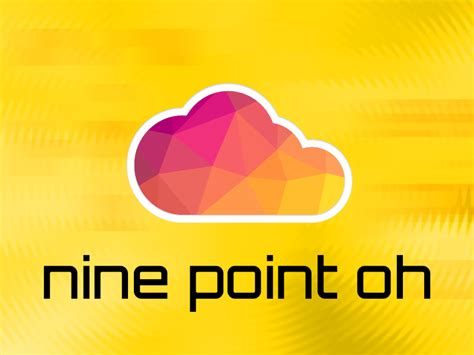
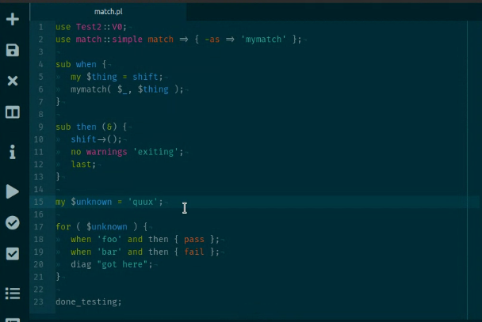
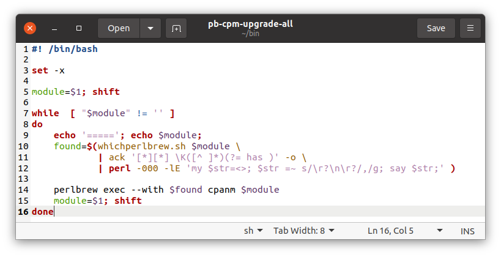

% Recent Virtual Era History 2020-present {#logo .float_r width=30% }
% Boston Perl Mongers
  Bill Ricker (& allied groups)
% 2020-present

# Boston.PM 

Boston Perl Mongers history is divided into four parts.

[Key Highlights (annals)](History-00.html)

* [Reconstructed Ancient History 1999-2005](History-01-Reconstructed-1999.html)
* [MIT Era pt i  2005-2016](History-02-Calendar.html)
* [MIT Era pt ii 2017-2020](History-03-Email.html) 
* [Recent Plague/Virtual era 2020-present](History-04-Virtual.html) ***this file***

(*Note. This file is in **chronological** order, most recent at the bottom.
The first two files are recent on top, or reversed order.
All start with a table of contents by year.*)

# The Virtual Era  2020-03-09 - Present

# 2020


*For the last meeting at MIT, see [2020 in MIT Pt ii](History-03-Email.html#section-3)*

With the onset of COVID-19 Plague (technically Pandemic),
we skipped March thru summer and went pure-virtual in fall of 2020.

## March 9th 2020 - COVID hits Boston, meeting deferred 

*Out of an abundance of caution and not having a speaker anyway, I'm canceling the meeting this month.*

*I wouldn't be surprised if April has to be held as a Google Hangout or IRC meeting or something, as MIT may be a closed campus by then.*

(*And then MIT canceled all non-essential gatherings for the duration.*)


[MIT March 9 2020](https://web.archive.org/web/20210316072924/https://news.mit.edu/2020/events-postponed-canceled-covid-19-0309)


We held no virtual meetings during the hard months, and then we often skip summer, so by fall, 
we could see what Natick FOSS and BLU were doing for virtual meetings.

##  Sept 8th aka March 192nd - trial Virtual meeting 

Boston.PM will try a virtual meeting for September 8th
(aka March 192nd ).

Topic: **What did you do on your summer vacation?**  *WFH & staycation (with Perl¹)?*


* **Ricky Morse**, 10 minutes on `Set::Tiny` `Email::Stuffer` and `Text::CXV_XS` [notes](http://pukku.com/bostonpm/2020-09-10minutes/index.html)
*  (*Narrator: Anyone else remember what they shared? No followups on list.*)


Where: JITSI 

¹ or other compatible, interesting FLOSS too

NOTE – This is as early as 2nd Tuesday can fall and is the day after the long Labor Day Weekend, so it will feel very Monday and not very Tuesday, let alone 2nd Tuesday !

We will use the Jitsi Meet service.


(If you need to hear my rant about why Zoom’s “fixes” are inadequate, ask me off-list.)

Jitsi is a Free/Libre OSS project sponsored by 8x8 (an Atlassian spin-off). It is the freemium base for their added-value corporate meeting & VOIP platform. As FLOSS, it can be self-hosted; they provide a free demo server. We will currently be using the free demo server, but may migrate to a hosted server (where we can set defaults, privileges).

Natick FOSS group has a 4-page Jitsi Help .pdf file, and you can practice beforehand.
(Natick meet 1st Thursdays, online, early afternoon)
Update to file ^ : Firefox latest versions 78+ support multicast, so are safer than before. Chrome/Chromium/FF78+ all plausible now.

One can use plain web mode, but if you can install the browser plug-in if you like. There are also iOS (iPhone/iPad) and Android apps which work well.

(I will replace this line with the link to the meeting room later)

JITSI scales fine to more people in face-sharing Brady-Bunch / Hollywood Squares mode than you can easily see at once (30ish) and if folks turn off their cameras (same as mikes) when just listening/talking, i.e. when not commenting/presenting, it scales much higher.

(If we later get more folks than will comfortably fit in Jitsi, we can set up a stream to YouTubeLive or some other platform … or upgrade to a proper panelist platform feeding a stream, but the “seminar” quality of Jitsi is fine for our level of anarchy.)

I will routinely mute those not presenting so you’ll usually need to unmute to comment.
Hint: Space-bar is push to talk, M is mute/unmute
(on phone/tablet it’s the skewmorphic microphone, avoid the handset hangup button!).
[Shortcuts](https://jitsi.github.io/handbook/docs/user-guide/keyboard-shortcuts)

## October 13th (aka March 227th ) - Virtual meeting - round-table 

## November 10th - Virtual meeting Round-table

Featuring Jerrad Pierce on [IO::Pager](https://metacpan.org/pod/IO::Pager)

## December 8th - Virtual Round Table 

News: CPAN announces they're sunsetting rt.cpan.org since diminishing usage; better support for migrating RT queue to GH is provided!


# 2021

## No January

## February 9th - virtual office hours

**Suggested topics:**


* **perl.com** got hijacked. It's gotten (mostly) un-hijacked.  
    - [_"The Hijacking of Perl.com"_](https://www.perl.com/article/the-hijacking-of-perl-com/) `brian d foy` official commentary;
    - [_"Hackers Control Perl.com Domain Months Before Hijack"_ - SecurityWeek](https://www.securityweek.com/hackers-control-perlcom-domain-months-hijack) *industry converage*;
    - [The Perl NOC](https://log.perl.org/2021/01/perlcom-hijacked.html) NOC Log;
    - "[_Perl-clutching hijackers appear to have seized control of 33-year-old programming language's .com domain_](https://www.theregister.com/2021/01/28/perl_hijacking/)" - *snarky IT news site TheReg has a chuckle*.


* **brian d foy** – "***Looking forward to Perl 7***", for Oslo Perl Mongers, Streamed 5 days ago <https://www.youtube.com/watch?v=TiGxe3wYhD8>

*  FYI, ***Perl 5.34.0*** is releasing this spring; the new Steering Council is (still) (re)considering the proposal for Perl 7.
   - 5.33/34 looks likely to have experimental feature try, catch keywords   (following syntax of (**Paul Evans** PEVAN's module **`Syntax::Keyword::Try`**)
   - (5.32 added `isa` to core, and chained comparisons :`if ( $x < $y <= $z )...` )

* **Paul Evans** ("LeoNerd", PEVANS) - Writing a Perl Core Feature - [Part 1](https://leonerds-code.blogspot.com/2021/02/writing-perl-core-feature-part-1.html) & [Part 2](https://leonerds-code.blogspot.com/2021/02/writing-perl-core-feature-part-2.html).

## March 9th, 2021 7pm Online -  Mark Gardner -  “Better Perl: Subroutine Signatures and Type Validation.” 

Summary: "Did you know that you could increase the readability and
reliability of your Perl code with one feature? I’m talking about
subroutine signatures: the ability to declare what arguments, and in
some cases what types of arguments, your functions and methods take"

Based on the blog post at [phoenixtrap](https://phoenixtrap.com/index.php/2021/01/27/better-perl-with-subroutine-signatures-and-type-validation/) 


## April 13th, 2021 7pm EST “Mojolicious Nine Point Oh!” -  Joel Berger



Summary: In this presentation, Mojolicious Core Team member Joel Berger will discuss some of the features of the recent Mojolicious 9.0 release and how they can improve your web (and async) applications.

**Joel Berger** is a **Mojolicious** Core Team member. He has a Ph.D. in Instrumentation Physics from the University of Illinois at Chicago and works at ServerCentral Turing Group. He lives in Chicago with his wife and 2 year old son. 

```
---------- Forwarded message ---------
From: Joel Berger 
Date: Wed, Apr 14, 2021 at 2:52 PM
Subject: Re: Tuesday - Tech meeting - Mojo 9 point OH!

BTW in looking to open a tracking ticket to
construct a guide for Mojo::DOM it seems we already have
one! <https://github.com/mojolicious/mojo/issues/1110> If anyone is
looking for a good way to contribute to Mojo (or just to open source)
without coding that would be a great way to do it!
```

(*My own comment is that an easily taught/comprehended Async framework is something i've been looking for since reading Dijkstra, Hoare, and ADA 35+ years ago. Rendezvous wasn't it. -- Bill*)

## Charlotte PM : Wed 28th, : Command Line Adventures in Perl - 2021 Edition - Jason Crome  (Joint Virtual Meeting)

*Our first Joint Virtual Meeting*

Boston.PM is invited to join **Charlotte PM**'s virtual meeting this Wednesday night, April 28th, 6PM EDT.

**Command Line Adventures in Perl - 2021 Edition**
 
Command line interfaces are an important part of managing many modern applications, and in 2021, there are no shortage of options for building them in Perl. In this talk, Jason will summarize many of the current options available, with an overview of the pros and cons of each. From there, he will explore how to construct a complex command line interface using CLI::Osprey, based on his recent experiences rebuilding the Dancer2 CLI.

**Jason Crome** is a longtime veteran of Perl and its community, is the TPF Grants Committee Secretary, and a member of the Dancer Core Team. He's currently a contractor at Bank of America building and maintaining payment processing systems with Perl and C++.

## Charlotte PM : WED May 26 "3 Not-So-Wise Men: Recent Misadventures" (Joint Virtual Meeting)

Once again, Boston PM will join forces with Charlotte PM for a virtual meeting.

**3 Not-So-Wise Men: Recent Misadventures**  …in which **Brian Wisti, Gizmo Mathboy, and Yanick** recount their recent (mis-)adventures with **Perl, Markdown, JavaScript,** and more to build blogs, games, Twitter posts, and other tools that are part of their everyday lives.

You’ll laugh, you’ll cry, you’ll question your life choices before all is said and done. There is something for everyone here, and it will be truly fun and entertaining 

Wed, May 26, 2021, 6:00 PM EDT

## June 23  (Turing's Birthday) - (BLU.org) No One Ever Buys a Computer - Jon "maddog" Hall

*Boston.pm and Charlotte.PM invited to BLU.org's virtual meeting*

Description: **Jon "maddog" Hall** discusses what customers really look for
Details at <http://blu.org/cgi-bin/calendar/2021-jun>
Organizer: [**Boston Linux + UNIX**](http://blu.org/)

*(If you don't recognize the name ... Jon is a pundit and sometimes board member on things Linux and FLOSS; he was the manager at DEC who was the first to give Linus some hardware for porting Linux. We can thank him that it's portable !)*

## June 16 (Joint Charlotte PM) - Rob "CmdrTaco" Malda talks Slashdot, Perl, moderation, and more!

*Boston.PM is invited to again join Charlotte PM's virtual meeting*

**Rob "CmdrTaco" Malda talks Slashdot, Perl, moderation, and more!**

*Hosted by Jason C. & Charlotte Perl Mongers*

Join us on June 30th for a special event featuring **Rob "CmdrTaco" Malda,** founder of **Slashdot,** as he talks about the quirkiness of Perl that led them to build Slashcode using our favorite language, the challenges of scaling Slashdot in the early days, and how they built up a system to deal with bad actors. We will leave time for Q&A at the end, but feel free to send your questions in advance of the talk.

**Rob Malda, aka CmdrTaco,** founded Slashdot in his dorm room at Hope College in the late 1990s, and with that, broke new ground in news aggregation and social content moderation. He's also the host of Geeks in Space, and a a maker of wooden pens.

Thanks to **Knowmad** (https://knowmad.com) for sponsoring our Zoom presence for this meeting, and to Boston.pm for cohosting the meeting with us. (*And thanks to Charlotte PM for arranging this and inviting us!*)

NOTE: Our speaker has asked that you leave your cameras on for this event. Also, he has a hard stop at 7:30, so please be prompt. There will be time for socializing after the talk. Look forward to seeing you all! 


(*Historical note: SlashDot was - still is! - an early Social Media website; it's platform SlashCode was Perl. [Boston.PM's founder Chris "Pudge" Nandor](./History-01-Reconstructed-1999.html#the-innocent-era---prior-to-regular-meetings) was an early employee after it got investment.*)

## Summer skipped as usual

Noted other meetings Calendar

* Wednesday, August 11, 2021  -  **Github Actions** — **Purdue** Perl Mongers (**HackLafayette**)
> Derrick will introduce us to GitHub Actions, which help you automate your projects
[TW{#tw height=20 }](https://twitter.com/JacobyDave/status/1424792673551065092)
[MU{#mu height=20 }](https://www.meetup.com/hacklafayette/events/jdxwsrycclbpb/)


* Wednesday, August 18, 2021 at 06:30 pm Boston Linux Unix ([BLU.org](http://blu.org/)) - Rocky Linux

> Rocky Linux - Overview of the official release of Rocky Linux
> Rocky Linux is a community enterprise operating system designed to be 100% bug-for-bug compatible with Red Hat Enterprise Linux (RHEL), now that CentOS has shifted direction.
> The first release of Rocky Linux is now available.
> Our guests provide an overview of the new release, and discuss both installing a new Rocky server and upgrading/migrating an existing CentOS server to Rocky.
<http://blu.org/cgi-bin/calendar/2021-aug>

* Wednesday August 25 - Charlotte PM hosting joint meeting - config roundtable

> Preliminary topic description -
> Everyone has a way for setting up a new workstation, account on a server, etc.
> Open Mic / Round-table discussion - what you do and why, so that others may learn.

## September 15th (Wednesday) - BLU: Annual Cryptology News & History - Bill R

No Boston.PM 2d Tuesday -- this month 2d Tuesday and 3d Wednesday are adjacent.

Boston.PM is invited to join BLU.org on 3d Wednesday, as I'll be giving the annual Crypto News & History briefing.
[BLU meeting notes](http://blu.org/cgi-bin/calendar/2021-sep)


## October 27th (Wednesday) - Cross-platform Flutter - Joint with Charlotte PM - Randal L Schwartz

**Why you should take a good look at Flutter for all platforms!**

[**Flutter**](https://flutter.dev) has come a long ways since its was first introduced a few years ago. Yes, even though Google is still in the driver’s seat for Flutter and Dart development, more and more of the contributions are coming from the community.

Google is highly committed to continuing to make Flutter the go-to SDK for user interfaces of all kinds. Of course it still does Mobile well (ios/android/fuchsia), but recently, major releases for Flutter on Web, Flutter on Desktop (linux, windows, macos), and Dart on every platform (including compiling go-like to a single binary with everything included) have continued to please the crowds.

Many large organizations have adopted Flutter, and some app-store apps have had literally millions of downloads.

I’ll be talking about the **Past, Present, and Future of Flutter and Dart.**

Topics covered:

  - What is Flutter anyway, and why Dart?
  - How does it compare to other multi-platform UI SDKs?
  - Flutter/Dart – past, present, future
  - Platforms Notable adopters
  - Q&A if there’s time

Where - Online event hosted by Charlotte.PM

When - Wed, Aug 25, 2021, 6:00 PM ET 

(*This repeated for [BLU in Feb 2022](http://blu.org/cgi-bin/calendar/2022-feb) which will have archived **video** and **slides**.*)

## No Tuesday in November

## Wednesday, November 17, 2021 - BLU.org - Introduction to Ceph - Neha Ojha


*Since Charlotte PM's regular meeting night is Thanksgiving ±1, they took off this November.*

*Boston.pm and Charlotte.PM were both invited to BLU.org's talk.*

Wednesday, November 17, 2021 from 6:30 pm to 9:00 pm

Location - Online at Jitsi

Presenters - **Neha Ojha** , Project Technical Lead for the Ceph RADOS subsystem , Red Hat Software - nojha redhat com

**A deep dive into Ceph (which is a distributed storage FLOSS project)**

Abstract

   What is Ceph? How is it different?

   Neha discusses basic Ceph architecture, including details about RADOS, RGW, RBD,
   and CephFS. She also discusses Ceph's management plane and details about the Ceph community and ecosystem.

## Weds. Dec 15th, "Budget Build Redux: Building a Box on a Budget with the AMD Ryzen 5600Gl" (BLU)

*invited to BLU.org again, periodic hardware build update*

[BLU notes](http://blu.org/cgi-bin/calendar/2021-dec)
"Budget Build Redux: Building a Box on a Budget with the AMD Ryzen 5600Gl"

"**Shankar Viswanathan** gives a technical overview of the newly released AMD Ryzen 4 series CPU; Kurt reviews the earlier Budget Build system discussed previously at the August 2020 BLU meeting, based on AMD's Ryzen 3 CPU; and **Brian DeLacey** discusses his newest Budget Build system, based on the new AMD Ryzen 4 CPU."


----------------------------

# Historical BOILERPLATE 2020-2022

(*This is the boilerplate as used fall 2020 - spring 2022.
Current boilerplate is below announced schedule [on homepage](index.html#boilerplate).*)

* Meetings hosted by Boston.PM are in [meet.Jit.si](https://meet.Jit.si) and on 2d Tuesday.
* Meetings hosted by [Charlotte.PM](https://www.meetup.com/charlotte-pm/) are in Zoom and on Last Wednesdays.
* Meetings hosted by Boston Linux Unix (<http://blu.org>) are in Jitsi and on 3d Wednesday.

  (If you need to hear my rant about why Zoom’s “fixes” are inadequate, ask me off-list.)
  Jitsi is a Free/Libre OSS project sponsored by 8x8 (an Atlassian spin-off). It is the freemium base for their added-value corporate meeting & VOIP platform. As FLOSS, it can be self-hosted; they provide a free demo server. We will currently be using the free demo server, but may migrate to a hosted server (where we can set defaults, privileges).
  Natick FOSS group has a [4-page Jitsi Help .pdf file](http://www.millermicro.com/FOSSUserGroupJitsi.pdf), and you can practice beforehand.  (They meet 1st Thursdays, online, early afternoon.)
 Update to file ^ : Firefox latest versions 78+ support multicast, so are safer than before. Chrome/Chromium/FF78+ all plausible now.

One can use plain web mode, but you can install the browser plug-in if you like (recommended if sharing slides or terminal). There are also iOS (iPhone/iPad) and Android apps which work well.


JITSI keyboard shortcuts - <https://jitsi.github.io/handbook/docs/user-guide/keyboard-shortcuts>

JITSI scales fine to more people in face-sharing Brady-Bunch / Hollywood Squares mode than you can easily see at once (30ish) and if folks turn off their cameras when just listening/talking, i.e. when not commenting/presenting, it scales much higher. (If we later get more folks than will comfortably fit in Jitsi, we can set up a stream to YouTubeLive or some other platform … or upgrade to a proper panelist platform feeding a stream, but the “seminar” quality of Jitsi is fine for our level of anarchy.)

I will routinely mute those not presenting so you’ll usually need to unmute to comment. Hint: Space-bar is push to talk, M is mute/unmute (on phone/tablet it’s the skeuomorphic microphone, avoid the handset hangup button!).

As now seen on [Perl Weekly newsletter](https://perlweekly.com/) Perl weekly {#pwnl height=30 width=117} and their [Events Calendar](https://perlweekly.com/events.html) - which you can import via the live [iCal calendar](https://perlweekly.com/perlweekly.ical) -- at least in months that i plan ahead (not this month). 

----------


# 2022

## January 11th - Boston.pm Virutal Round Table 

Using a variation Dallas.pm's "run this Perl command to get the URL" security indirection this month.
(Designing it to work in any TZ  364 days of the year is tricky ...)
Run this command on day of a Boston.PM meeting to get the URL.
(If you don't have SSH to a VM on your iPhone, DM me or email me. As shown here, the result goes out in the email but not on the more modern Social Medias.)

```
perl -MDigest::SHA=sha1_hex -MPOSIX=strftime -le 'print strftime "%Y/%m/%d week %U", localtime; $date=strftime "Y%Y W%U", localtime; print $date; print  "https://meet.jit.si/BostonPM-".sha1_hex("BostonPM".$date);'
2022/01/11 week 02
Y2022 W02
https://meet.jit.si/BostonPM-53d228e2ce1c71d05d0c3673096b1fcf874bcef2
```

## January Charlotte rescheduled

## Feb 8th Boston Perl Mongers tech/social virtual meeting (round-table)

With special guest appearance of Boston.pm member emeritus **Federico Lucifredi**

##  Wednesday, February 23, 2022 - Developing a caching plugin for HTTP::Tiny - Mark Gardner 

In 2015, Mark Gardner developed a caching subclass of **`LWP::UserAgent`**. This month, he is going to talk about his journey in converting that to a plugin using **perlancar's `HTTP::Tiny::Plugin`**.

**Mark Gardner** is a professional Perl developer with over twenty-five years experience in various industries including pharmaceuticals, e-commerce, and web hosting. For the past year he’s been writing weekly at phoenixtrap.com about Perl-related topics, helping other developers engineer modern, disciplined applications with confidence.

## March 8th - Virtual Round Table 

## April 12th - Downloading AO3 bookmarks for offline reading - Ricky Morse

"continuation of my 'let me make sure I can entertain myself when I'm 90' series."

**Ricky Morse**

Ricky has previously shown us Perl scripts to make offline backups of various media he'd like to see again (without relying on the continued solvency of Archive.org).
This will be another variation.

[notes](http://pukku.com/bostonpm/2022-04-download-ao3/index.html)

## Wed May 4th (with Charlotte PM) - Semantically-Friendly DB Searches - D Ruth Holloway

In her quest for more-readable code, **D Ruth Holloway** has been working on some [DBIx::Class](https://metacpan.org/pod/DBIx::Class) [Dancer2](https://metacpan.org/pod/Dancer2) plugins for smoother, more semantically-friendly database searches. As a preview to her TPRC::Houston talk in June, come see these modules, and learn how to use them to make your own database queries faster, smarter, and easier to read.

(*This was a Preview of [Conference Talk re-titled "The Database Dance - DBIX and Dancer treachery to increase performance"](https://www.youtube.com/watch?v=o4H_DpewCws), which has following abstract.*)

> Writing web applications with DBIx::Class and Dancer2 is super-easy. Learning how to make them efficient takes a little longer. Come see some of the things that Ruth has learned—and created—that make these apps faster and easier to maintain.

> Writing inefficient applications is startlingly easy to do; some of my early Dancer2 work shows it! In this talk, we’ll discuss ways to structure queries and code to speed things up, and show some of the tools that are available for Dancer2 and DBIx::Class that make maintaining these systems just a bit easier.

> Ruth has been writing Perl for 21 years, and attending Perl conferences for the last ten years, speaking at all but one of the in-person conferences. She is a big fan of DBIx::Class, Dancer2, and Agile programming without all the ceremonies. Ruth is a wife, writer, cook, autoharpist, and mommy to the cutest dog you will ever meet.

## May 10th Using Perl's Twitter::API - Bill R

**Bill Ricker**, inspired by Ricky's talk on archival web scraping last month, revisits the
**[`Twitter::API`](https://metacpan.org/pod/Twitter::API)**.

One script is a daemon used to automatically retweet useful announcements posted to a monitored Twitter account. The other will archive a Twitter thread in text format (and can safely be re-run when the tread gets longer). It avoids depending on a 3rd party service, which use tracking, ads, and might disappear, to host the archived thread.

(My sample script is quite tuned to the [thread](https://twiter.com/elevennames/status/1509876985744355329) I wished to archive, as it heuristically extracts proper nouns.)

[unroll.pl.html](./scripts/unroll.pl.html) ([.pl](./scripts/unroll.pl))


## May 25th (hosted by Charlotte PM) Richard Hipp Talks About All Things SQLite

(*May appear on Charlotte PM YouTube eventually.*)

<https://en.wikipedia.org/wiki/D._Richard_Hipp>

"SQLite is an SQL database engine that can be used in applications as a library for quick read-write operations. Unlike other database management systems, SQLite is not a client-server database designed to run in a data center. D. Richard Hipp is the architect and primary author of SQLite and the Fossil SCM." - [S E Daily](https://softwareengineeringdaily.com/2015/11/13/sqlite-with-d-richard-hipp/)

[CoRecursive podcast #066](https://corecursive.com/066-sqlite-with-richard-hipp/) appears to be similar content for those who missed it.

[SQLite](https://en.wikipedia.org/wiki/SQLite)

## June 15 (hosted by Boston Linux Unix)  Private Google Docs at Home using SeaFile and LibreOffice Online

SeaFile and LibreOffice Online together provide most of the functionality of Google Docs [BLU](http://blu.org/cgi-bin/calendar/2022-jun)

## June July August Canceled for Summer

## 2d Tuesday, Sept 13, What's new in Perl 5.036 

A group discussion of the latest [`perldelta`](https://perldoc.perl.org/5.36.0/perldelta) - which prepares for October's future of Perl OO.

We reviewed

* <https://stackoverflow.blog/2022/09/08/this-is-not-your-grandfathers-perl/>
* [PumpKing RJBS musings](https://rjbs.cloud/blog/2022/05/perl-5.36/)
* [`perldelta`](https://perldoc.perl.org/5.36.0/perldelta)

***Highlights***

* signatures graduate from experimental
* `try` + `catch` + `finally` + `defer`
* `use v5.36`  is (almost) sufficient boilerplate (almost = new experimentals need `use` )
* n-at-a-time iteration
* `builtin::` Experimental namespace


***Other Mentions***

* [Petit Parser](https://petitparser.github.io/) vs Marpa parser ([CPAN](https://metacpan.org/dist/Marpa-R2/view/pod/Marpa_R2.pod), [academic paper](https://arxiv.org/abs/1910.08129), [home](https://jeffreykegler.github.io/Marpa-web-site/) )
* [DiffTool that knows what you mean](https://hackaday.com/2022/09/10/diff-tool-knows-what-you-mean/)
* The D language has a [Schwartz_Sort](https://dlang.org/library/std/algorithm/sorting/schwartz_sort.html) ... which they did NOT tell Randal [when he interviewed them.](https://twit.tv/shows/floss-weekly/episodes/311)

## Tuesday, Oct 11, 7pm ET &#127482;&#127480; Boston PM: OPEN DISCUSSION

A good discussion was had but i didn't take notes.

Randal (Merlyn) , Dan (swagg boi), Jerrad, Bill.

## Wednesday Oct 26th, 6pm ET  &#127482;&#127480;  - Charlotte PM - Baking backend: a study - Yanick

Writing backends doesn't have to be a pain in, well, there too.

Yanick ~will~ share*d* how he's building the backend of **smol** -- a site showcasing painted miniatures -- leveraging **sveltekit**, **svelte-query**, **openapi** and **JSON:API** to achieve maximal self-documentation and consistency with as little boilerplate as possible. We'll see how the backend endpoints are built, how they can be documented as painlessly as possible, and how they can be plugged in on the fronting web application with minimal effort and no code duplication.

(*warning: presentation contains no Perl. But there will be a healthy helping of TIMTOWTDI*)

Yanick has been using Perl for, uh, let's go for "a while". Erstwhile member of the core Dancer team, past co-editor of the Perl Weekly, ex-contributor to the Perl Review, he has 103 distributions to his name on CPAN, which is frankly a tad excessive. He works at Infinity Interactive.


Yanick Champoux shares: «Slides are at <https://techblog.babyl.ca/opus/talks/smol-backend/#/>.»


## no meetings Nov-Dec

# 2023

## no meetings January


## Tuesday, February 14th &#x1F498; , 6:30 PM &#127482;&#127480; Boston PM: `match::smart`, `match::simple` - Toby Inkster (live)

With P5P actively moving forward from deprecation to Warning and eventual removal of the v5.10 SmartMatch `~~` operator -- for good reason, it was underspecified, nondeterministic, and outright dangerious -- there's a question for those who found a subset of its capabilities useful. Prolific module author [Toby Inkster](https://metacpan.org/author/TOBYINK) provides a safe, deterministic subset of smart-match in [`match-simple`](https://metacpan.org/dist/match-simple) distribution which provides  [`match::simple`](https://metacpan.org/pod/match::simple) and [`match::smart`](https://metacpan.org/pod/match::smart)  with optional [XS accelerator](https://metacpan.org/dist/match-simple-XS).

(*with apologies to anyone who has other plans that &#x1F498; evening. this is the risk of 2d Tuesday scheduling.*)

**Toby Inkster** is a consultant for The Perl Shop. 
He has been working as a software developer for over 20 years, 
focusing on databases, the Web, and the places where they overlap. 
Toby has contributed to popular Perl open source libraries such as 
the light-weight object-oriented programming tool Moo,
as well as being the lead developer of Type::Tiny. 
He has an interest in the Semantic Web was an invited expert to the W3C RDFa 
Working Group. He also enjoys cooking and likes cats.

`match::simple` and `match::smart` are survivable substitutes for the deprecated `~~` smartmatch operator, either as a fake operator or as a callable routine renamed to caller's convenience.  The 'simple' variant has predictable semantics; the 'smart' variant emulates (nearly) the full inconceivable complexity of the deprecated `~~`, which provide a survival path for some code.


```
use v5.10;
use match::simple;
 
if ( $this |M| $that ) {
   say "$this matches $that";
}
```

When asked if he also provided a substitute for the `given ... when ...` keywords, he replied not currently (syntax module he'd used has been deprecated), but it's not hard to do, e.g.:



---

## CSV Utilities (ad hoc topic, February)

In discussion after, Jerrad discussed CLI utilities 
`csv-grep`, `csv-munge-row`,  etc from **[`App::CSVUtils`](https://metacpan.org/pod/App::CSVUtils)**

---

## Tuesday, March 14th (π day = &#x1F967; day), 6:30 &#127482;&#127480; EDT(UTC-04)  Boston PM: Ovid(tape)+LeoNerd(live) on Corinna - OO in Perl5 Core


We'll have **Curtis *"Ovid"* Poe** on the strategy of Corinna project (_by the magic of tape delay_) and **Paul "[`PEVANS`](https://metacpan.org/author/PEVANS)/[`LeoNerd`](http://www.leonerd.org.uk/)" Evans**, Perl Steering Committe and `Object::Pad implementor`, ***LIVE*** for the practicalities and Q&A.

Last summer, Ovid posted exciting news -

> "For #perl devs wondering how the Corinna #oop project is going, @cpan_pevans
is now working on stage 1 of the accepted portion of the RFC. I've put that in the [repo](https://github.com/Ovid/Cor/blob/master/rfc/mvp.md) so you can follow along"  
> [`@OvidPerl` 2022-08-18](https://twitter.com/OvidPerl/status/1560305460707827715)

Just recently in mid February 2023, Ovid and Paul again shared exciting news: P5P's upcoming development release Perl 5.37.9 (alpha/beta for 5.40.0) will contain  
 **`use feature 'class';`**  
It has been merged.

Ovid is the architect and Paul is the lead developer for adding a new object-oriented system called Corinna† (formerly & confusingly "Cor" into Perl 5 Core. They've had an open community process to develop an RFC or proposal and prototype, but until recently, without commitment for the Perl 5 Porters (P5P) to actually implement it in Perl 5. Over the summer, P5P have approved the initial Stage 1 integration into Perl Core. While we've had 20+ years of new OO packages for Perl5 since 5.0, this is the first actual (as opposed to proposed) overhaul of the *core* OO system in Perl 5.

PEVANS's non-Core, prototype is [Object::Pad](https://metacpan.org/dist/Object-Pad), which can be conditionally imported in compatibility mode via [Feature::Compat::Class](https://metacpan.org/pod/Feature::Compat::Class).

Ovid's recent writing on Corinna are [on his blog](https://ovid.github.io/tags/corinna.html).

The [Corinna project](https://github.com/Ovid/Cor) has a  [wiki](https://github.com/Ovid/Cor/wiki) and the [RFC](https://github.com/Ovid/Cor#rfc) that proposed adding Corinna to Perl 5 Core, and the P5P-accepted Stage 1 [Minimal Viable Product RFC](https://github.com/Ovid/Cor/blob/master/rfc/mvp.md). [His 2021 editorial](https://dev.to/ovid/bringing-modern-oo-to-perl-51ak) explains the difference between Moose (*et al*), Stevan Little's Moxie, and Corinna.

***Damian Conway*** posted an exultation for the (January 2022) P5P approval of the Stage 1 MVP RFC _but i can't find it again_. His previous writings endorsing the project are

* [A (not so) simple matter of privacy 2021-DEC](http://blogs.perl.org/users/damian_conway/2021/12/a-not-so-simple-matter-of-privacy.html), 
* [A dream resyntaxed 2021-Nov](http://blogs.perl.org/users/damian_conway/2021/11/a-dream-resyntaxed.html)
* [A dream realized 2021-Aug](http://blogs.perl.org/users/damian_conway/2021/08/a-dream-realized.html)

† _Corinna_ is a classical allusion in connection to Curtis's pseudonym _Ovid_, which explains the classical (and otherwise potentially NSFW) image on the MVP RFC tweet.

### minutes

attending

* Bill R
* PaulEvans/LeoNerd (~co-~presenter)
* Ricky M
* Jonathan F
* Kripa
* Tom M
* zaki

### media

* [Ovid Cor Video (2021) FOSDEM - purpose and design](https://youtu.be/kSZO-aJg4dM) 2 years ago
(alternative somewhat more recent [2022 video](https://youtu.be/5lSdBSCkFGs) is only slightly different but has audio dropouts )

* [Paul's Slides on implementation Status](https://go.leonerd.org.uk/corinna-and-feature-class-2023)

### CPAN references

To get the latest Dev Perl (before 5.38.0 arrives in May), `perlbrew install perl-blead` .

* 5.37.9 [perldelta](https://metacpan.org/release/ETHER/perl-5.37.9/view/pod/perldelta.pod) giving `use feature 'class';`.  [perlclass](https://metacpan.org/pod/release/ETHER/perl-5.37.9/pod/perlclass.pod) [perlclassguts](https://metacpan.org/pod/release/ETHER/perl-5.37.9/pod/perlclassguts.pod)

* [`Object::Pad`](https://metacpan.org/pod/Object::Pad) for prototypical moving target.
* [`Feature::Compat::Class`](https://metacpan.org/pod/Feature::Compat::Class) for stable version usable in older Perls (5.18+).
* also [`Feature::Compat::Try`](https://metacpan.org/pod/Feature::Compat::Try), [`Feature::Compat::Defer`](https://metacpan.org/pod/Feature::Compat::Defer)
* [`Struct::Dumb`](https://metacpan.org/pod/Struct::Dumb) automatically `uses feature 'class';` at Perl 5.37.9 and above. `Struct::Dumb` is already used in a [number of modules](https://metacpan.org/module/Struct::Dumb/requires).

* [Cor(inna) Wiki](https://github.com/Ovid/Cor/wiki)

----------------------------

## April 11th, no meeting 

----------------------


## May 9th, Using `MP3::Tag` & `Syntax::Keyword::Try` etc to make playable audio archives with legible titles 

In pre-meeting **Jarred** discussed [SIGBlovik: The Association for Computational Heresy](http://sigbovik.org/), a parody computer science special-interest group, which has paper and [video](https://www.youtube.com/results?search_query=sigbovik) proceedings, in particular [ GradIEEEnt half decent: The hidden power of imprecise lines ](https://www.youtube.com/watch?v=Ae9EKCyI1xU). And [**Randal**](https://www.youtube.com/c/RandalLSchwartzonDartandFlutter) previewed the release of [Dart 3.0](https://en.wikipedia.org/wiki/Dart_%28programming_language%29)/[Flutter 3.10](https://en.wikipedia.org/wiki/Flutter_%28software%29) later this week.

Since I (Bill) failed to cancel the meeting or line up something better, we dove into my Backup Topic.

### Using `MP3::Tag` & `Syntax::Keyword::Try` etc to make playable audio archives with legible titles 

This [script (Tidy html)](./scripts/mp3info.pl.html) ([`mp3info.pl` (raw)](./scripts/mp3info.pl)) exists to (a) scratch an immediate itch and (b) experiment with a few modules. No claim is made to best usage of any of these features! The Itch was scratched, and pudding was proofed.

The Itch was that in moving old podcast files off a modest M.2 SSD to archival spinning rust drive (which is normally kept Read-only mounted for safety), I did not want to rely on Rhythmbox or other music/pod player being sane about browsing/playing a read-only drive where it couldn't mark things PLAYED. I did need to move most of my older mp3, ogg, etc collection that wasn't "in queue" to larger passive storage to make space. But i didn't want to lose the ability to search by track title etc, which usually aren't fully encoded in filenames. As i expected, there's a CPAN module for accessing mp3 etc meta-data tags. So it should be trivial to recursively write HTML indices for directories containing MP3s, with links that will play a file, right? 

(_more commentary is in the linked file._)

### CPAN references

* [`MP3::Tag`](https://metacpan.org/pod/MP3::Tag)
* [`URI::Encode`](https://metacpan.org/pod/URI::Encode)
* [`Path::Tiny`](https://metacpan.org/pod/Path::Tiny)
* [`File::Stat`](https://metacpan.org/pod/File::Stat)
* [`Readonly`](https://metacpan.org/pod/Readonly)
* [`Syntax::Keyword::Try`](https://metacpan.org/pod/Syntax::Keyword::Try) [`:experimental`](https://metacpan.org/pod/Syntax::Keyword::Try#Experimental-Features)

-----

## June ... September 2023 - No meetings, Summer hiatus 

_A proposed July meeting on Async Graphics didn't happen because RealLife™ intervened._

----

## October  11th - un-meeting 
## November Cancelled


## December 12, 2023 - Informal Meeting

(I don't have notes on what Perl News was discussed)

# 2024

## Tuesday, January 9th 7 PM &#127482;&#127480; - un-meeting

**The most Perl-compatible RE engine remains Perl**. [Wikipedia](https://en.wikipedia.org/wiki/Comparison_of_regular_expression_engines#Part_1) has a two-part table of features. 

Randal "Merlyn" Schwartz reports that he's naturally a guest on the newly re-reborn **Floss Weekly** show, now hosted via HackaDay.

[RSS](http://feeds.libsyn.com/499093/rss)
[#765](https://flossweekly.libsyn.com/episode-765-that-ship-sailed-and-sank) 
as seen on [Fediverse](https://schleuss.online/@itnewsbot/111728848176983347) → [Hackaday](https://hackaday.com/2024/01/09/floss-weekly-episode-765-that-ship-sailed-and-sank/) 

> **FLOSS Weekly Episode 765: That Ship Sailed… and Sank** - This week Jonathan Bennett and Aaron Newcomb talk with Randal Schwartz, the longest running host of FLOSS Weekly, Perl’s biggest cheerleader, and now Dart and Flutter expert. What’s new with Randal since his last FLOSS Weekly episode in May 2020? Why should you look at Dart and Flutter? And how do you avoid becoming a security martyr?) …

## Tuesday, February 13th, 2024 - canceled due to impending blizzard

that missed 30 miles south, alas

## Tuesday, March 12th, 2024 - cancled due to health

sorry, Bill couldn't.

## Tuesday, April 9th, 2024 - using new Class syntax

While I was able to chase the Eclipse, I didn't get caught in traffic, so surprise, meeting held.

The topic is Dave Cross's recent CPAN upload [**Amazon::Sites**](https://metacpan.org/pod/Amazon::Sites ) [0.1.6](https://metacpan.org/release/DAVECROSS/Amazon-Sites-0.1.6/source/README.md) that makes good use of the Ovid=Curtis and PEVANS=Leonerd's new experimental built-in  [`feature class` syntax](https://perldoc.perl.org/feature#The-'class'-feature) (via the compatible wrapper [Feature::Compat::Class](https://metacpan.org/pod/Feature::Compat::Class)) and `signatures` to make a real-world useful CPAN ojbect using latest Perl features. Dave Cross got some help in FB "The Perl Community" :

[Request for Help](https://www.facebook.com/groups/perlcommunity/posts/1639477536859866/)

> **Dave Cross**  
> I released a new CPAN module called `Amazon::Sites`. It uses `Feature::Compat::Class` and subroutine signatures. And CPAN testers tells me that it is failing to compile on Perl 5.24. It looks like the failure is because of my use of signatures - but they were introduced in Perl 5.20, so I can't see what the problem is.

> **Leon Timmermans**  
> Yeah, if you want to use signatures in `Object::Pad` methods you need 5.26. This issue is not solvable as earlier perls don't provide the underlaying primitives needed to implement this.

[Exposed compatibility issue in CPAN PAUSE](https://www.facebook.com/groups/perlcommunity/posts/1643221256485494/)

> **Dave Cross**  
> More about the `Amazon::Sites` module I was asking for help with recently.  
[https://perlhacks.com/2024/03/amazon-links-and-buttons/](https://perlhacks.com/2024/03/amazon-links-and-buttons/)


> **Joshua S. Day**  
> @ **Dave Cross** I notice that you have a class inside a package by the same name. Is there a reason the whole file isn't just a class?

> **Dave Cross** Author Admin  
> **Joshua S. Day** It's because the `PAUSE` indexer hasn't kept up with the new OO syntax and doesn't (yet) recognise the "class" keyword as introducing a package.
> See https://github.com/andk/pause/issues/436
> …
> My first attempt at uploading the module failed for this reason. I got email from **Neil Bowers** explaining the problem and he raised the ticket above.
> I'm not expecting anything to change until after the Perl Toolchain Summit next month

It's a very simple set of 2 classes (a collection class and a single-thing instances class) that solves a real problem without needing features that aren't in the experimental core `feature class` yet.

### When is a JAPH not a JAPH

**Fediverse (Mastodon etc) has `#perl` activity**.  A delightful not-just-a-JAPH showed up today.

[Serpent7776 2024-04-09](https://mastodon.social/@Serpent7776/112242749915834369)

> Definitely don't run this random #perl code

```
my@a=sub{my@a=@_;
map{(-10, -12, 86, 56, -82, -5, -82, 1, 73, 54, -13, -70)[$_]+$a[$_]} 0..11
}->((unpack("C*", 'rm -rf')) x 2);my@w=(0x64, 0x61, 0x79);
print eval "'" . pack("C*", @a) . pack("C*", @w) . "\n'";
```

[Apr 09, 2024, 14:47](https://mastodon.social/@Serpent7776/112242749915834369)

_yes it looks scary, but that's just raw characters being reprocessed to pring something friendly._

This reminded Randal of a [JAPH he perpetrated](https://www.perlmonks.org/?node_id=1198781) a long time ago, the `oh, turtleneck Phrase Jar!`, which abused `tr` to transpose an anagram rather than transliterate.


----


### Eclipse 2024 discussion
And we of course compared our **Eclipse experiences** the prior day.  I (Bill) opted for 97% in Mom's driveway — celebrating memory of her taking me to Grandfather's for Eclipse of 1963 — and concentrated on the experience rather than photography but got a [few photos](https://pixelfed.social/i/web/post/683385129870968035).  I got 140 minutes between 1st and 4th contact.  The 3% Maximum period was perhaps longer than Totality for those there, and was differently fascinating; the remnant sliver seemingly rotated **around** the shadow as the shadow slowly shifted across the sun's disk from pseudo-2nd-contact to pseudo-3rd-contact. NASA posted an image showing this from [Washington DC](https://nasa.tumblr.com/post/747233450847862785/follow-follow-the-sun-and-which-way-the-wind).


  NOAA as usual posted an animation of the eclipse [Penumbra (the broader partial eclipse shadow) crossing the continent](https://vis.social/@joemurph/112237534904015218) [hires Y-T](https://www.youtube.com/watch?v=MoDBHIlY9FA)
[Friends of Nasa](https://www.friendsofnasa.org/2024/04/solar-eclipse-2024-high-res-orbital.html) has some low-orbit close-ups too, as does [space.com](https://www.space.com/solar-eclipse-2024-satellite-moon-shadow-video-photos). 

Space(.)com pub'd a NASA image shot from [ISS that's a "closeup" of Quebec + Maine](https://www.space.com/solar-eclipse-2024-satellite-moon-shadow-video-photos) in shadow (Penumbra; Totality or Umbra is the thin densest core).

+----------------------------+------------------------------+
|E                           |                             S|
+----------------------------+------------------------------+
|                                                           |
| |
+----------------------------+------------------------------+
|N                           |                             W|
+----------------------------+------------------------------+

> «Astronauts on the International Space Station snapped this photo of the moon's shadow on covering portions of the Canadian provinces of Quebec and New Brunswick and the American state of Maine from its orbit 261 miles above Earth during the April 8,2024 total solar eclipse.  > (Image credit: NASA)»

(pov is looking South East over Quebec to Maritimes and New England; PEI&NS/NB upper-left, Cape Cod is at the edge of the clouds to right. 
Gaspé peninsula center left is where I enjoyed the [Eclipse of 1972](https://en.wikipedia.org/wiki/Solar_eclipse_of_July_10%2C_1972). When the Gaspé is the most populous spot for an Eclipse ... )

----

## Tuesday May 14th, 2024 

* Attending: Bill, Ricky, ~~Randal?~~, Chuba.


* Stringy Eval redux  - Paul Cochrane [Mastodon/Fediverse/AP](https://fosstodon.org/@peateasea@mastodon.social/112325534497525886) ⇒ [Avoiding stringy eval in Perl](https://peateasea.de/avoiding-stringy-eval-in-perl/)

* Why do 6-digit confirmation codes (2FA etc) seem to \^always\^ have patterns?
    * would [`Poker::Eval`](https://metacpan.org/dist/Poker-Eval) help? Not really.
    * can use [`String::LCSS`](https://metacpan.org/pod/String::LCSS) to find sequences, and plain Perl for finding pairs/threes
    * [`codes-poker.pl`](./scripts/codes-poker.pl.html)
    * with only ten digits (vs 1-9,10,J,Q,A = 13 values=digits in Poker) and 6 cards, no pair and no sequence (allowing run of 3+ ala Gin Poker aka Gin Rummy) is very unlikely.
    * Unlike Gin or (Whiskey) Poker, not allowing reordering cards in hand to form sequences s (but non-adjacent pairs, trebles ok  `152595` treble but not sequence or repetition); for mnemonic value in a 2FA confirm code, must be a sequence in the random digits as given. So `345655` is sequence of four, pair 5, repetition of 5, but `345556` is only sequence of 3 with treble 5.

```
$ perl codes-poker.pl 2>&1 | less
1000
123455 = rep:2:55,seq:5:12345,pair ;
123123 = rep:3:123,seq:3:123,pair,pair,pair ;
123456 = seq:6:123456 ;
246890 = seq:3:890 ;
246870 = seq:4:2468 ;
152595 = three ;
345655 = rep:2:55,seq:4:3456,three ;
345556 = rep:3:555,seq:3:345,three ;
        # first random hand:
019227 = rep:2:22,seq:2:01,pair ;
…
597386 = nothing ;
…
402701 = seq:2:01,pair ;
105743 = seq:2:10 ;
200816 = rep:2:00,pair ;
527139 = seq:2:13 ;
405750 = seq:2:57,pair,pair ;

15 nothings; 0.015
```

* OpenCage has subscription API amalgamating open geo data; inexpensive geocoding.
    * [Fediverse post](https://fosstodon.org/@opencage@en.osm.town/112417428472786162) on GeoWeirdness in Catalonia, reminded me of their existence.
    * [demo](https://opencagedata.com/demo)
    * annotations provide one-stop shopping for many "what would i ask for next" answers!
    * [API docs](https://opencagedata.com/api#annotations)
    * [CPAN](https://metacpan.org/search?q=opencage)
        *  [`Geo::Coder::OpenCage`](https://metacpan.org/pod/Geo::Coder::OpenCage)
        *  [`Geo::Coder::Many::OpenCage`](https://metacpan.org/pod/Geo::Coder::Many::OpenCage) 
           *  plugin for [`Geo::Coder::Many`](https://metacpan.org/dist/Geo-Coder-Many) 
        * [Perl specific tutorial!](https://opencagedata.com/tutorials/geocode-in-perl)
        * [PerlAdvent 2016](https://perladvent.org/2016/2016-12-08.html) would be why I'd heard of them before.
        * I'd prefer OpenCage to [`Geo::What3Words`](https://metacpan.org/pod/Geo::What3Words), as that requires agreeing to would-be monopolist API key TOS (if I see any reason to even use w3w).
    * API key use for testing is free but with tight rate limit; very reasonable prices for supported "Production" used, scaling by usage needed. Seems fair.

* Other: Non-technical or at least not Perl
    * Russian tourism during Glasnost
    * Astronomical App for photographers to line up the Washington Monument photo in last month's Other.
    * [Centimeter resolution GPS](https://n1vux.github.io/articles/Geodetic/RTK-experiments.html) on a hobby budget.

----

## Tuesday June 11th, 2024 - Perl 5.40 released ! 


Since the [Perl Weekly 672](https://dev.to/szabgab/perl-weekly-672-its-time--2dab) and other channels have announed release of **Perl v5.40**, let's dive in and see what's new.  A lot of stuff previously experimental is now stable, as well as some new-new stuff.

Bill, Jerrad, Ricky, Mike S, Chuba

* https://metacpan.org/release/HAARG/perl-5.40.0
* https://metacpan.org/release/HAARG/perl-5.40.0/view/pod/perldelta.pod
* https://metacpan.org/pod/Test2::Suite


----

## Tuesday July 9th, 2024 - Bill's `feature class` proof of concept and ensuing discussion

I've been experimenting with Perl v5.40's **`feature class`** and prototype `Object::Pad` and some recently updated modules, e.g. `Data::Enum` latest supports `match::simple::sugar` which together provide a replacement for what I liked in the doomed `given-when` hypermatch. `Getopt::Declare` isn't exactly recent but I like it. `Perl::MinimumVersion`'s `perlver` is also cool. 

* `feature class` introduced in Perl v5.38 has two major improvements [`:reader`](https://perldoc.perl.org/perlclass#:reader) and [`__CLASS__`](https://perldoc.perl.org/perldelta#New-__CLASS__-Keyword), which make it reasonably fun to use.
* [`Feature::Compat::Class`](https://metacpan.org/pod/Feature::Compat::Class) provides a simple invocation of `feature class` if running Perl v5.38+ or [`Object::Pad`](https://metacpan.org/pod/Object::Pad) if not. 
    * if prototyping in Object::Pad not just falling-back to, need to add `:strict(params)` to detect incorrect constructor keys; not permitted/not needed in `feature class`.
* [`Data::Enum`](https://metacpan.org/pod/Data::Enum) recently revved to add a hook for [`match::simple::sugar`](https://metacpan.org/pod/match::simple::sugar) compatibility so that a variable containing a singleton `Data::Enum` value be matched against strings in a `for-when` block. (I do like that the enum is implemented as a set of singletons.)
```
    LINE: while (<>){
    SWITCH: for ($STATE){
        when 'none', then { … };
        when 'header', then { … };
        when 'line', then { … };
        }
    }
```
* My suggestions *`match::simple::sugar`* documentation*, [issues from lessons learned](https://github.com/tobyink/p5-match-simple/issues).
        * `no feature 'switch';  # or use v5.36; or greater` to avoid deprecation warning and resulting syntax fail
        * my other documentation issues / lessons learned:
            * when using `match::simple::sugar` (with `Data::Enum` that now supports `match::simple` !), when nesting the switch `for () { when ..., then{}; ...}` non-looping loop block within an outer `for()`, `foreach()` or `while(<>){}` actual loop _~as one does~_, whether as an event loop or per-line-input loop, there are three implications that should be documented; one of which might be fixable in module code.

1. the outer loops must use a named loop variable, or (minimally invasive) have a local `my $line=$_;` just before the `SWITCH: for when`, and any and all implicit `m{}`, `//`, _etc_ or explicit references to `$_` must be changed to `$line =~ m{}`.

2. outer and inner loops need `LINE: while(<>){...}` and `SWITCH: for ($STATE){when ..` statement labels, as `when...then` will do `next` on the inner `for` as if it were a loop, so script's own loop control `next`, `redo`, `last` must name `next LINE;`.

3. to avoid a ~flurry nay~ blizzard of `Exiting subroutine via next at` warnings on STDERR, must insert `no warnings 'exiting';` after `SWITCH: for ($var){`  .

* I would _not_ put the `no warnings` outside the for-when lexical block, so as to not block warnings caused by other errors.  It might be practical to inject the `no warnings 'exiting';` into the anon-subs made from the `then {block}` ?

* (Near as i can tell, there's no danger of an innermost loop inside the `then{}` clause having a problem, as the hidden `next SWITCH` by the `when` occurs after the `then{}` anon sub returns to `when`, if i don't `next LINE;` out of it.)

* Additional warning required, that **`return`** in the `then {BLOCK}` won't do what is expected, but rather returns from the `when-then` anon-sub (lambda).

* Would need to return up the call stack to return from my visible sub.

* (Instead i just have a `$ret` value the way we used to do when one in one out structured programming forbade return from anywhere except the bottom of the subroutine. )
* (Aside: Probably helped that I'm old enough to have suffered under that formalism. Which did let us reason over programs, and I have proved several production loops correct according to precondition, invariant, progress, postcondition, which benefited from no early exits / no gotos. But readable code is more useful most of the time. 🤣 )


* [`perlver`](https://metacpan.org/release/DBOOK/Perl-MinimumVersion-1.42-TRIAL/view/script/perlver) reads your script or collection of modules and reports what is required to run it - both by checking explicit demand but what is actually used. It's not perfect yet, [we're hammering edge-cases](https://github.com/neilb/Perl-MinimumVersion/issues). If you like Postderef as I do, get the DEV version 1.42-TRIAL version not the 1.40 current 'production' version, if that is still current when you read this.

Comments

* Ricky notes I could use new built-in `weaken` and `trim` if commiting to v5.40 rather than using `Feature::Compat::Class`
(`trim` is ok for this app as replacement from `chomp; chop if /\r\z/;` as mandatory id at front doesn't allow for leading spaces)

* Jerrad notes `perl -CA` handles @ARGV decoding [perlunicookbook](https://www.perl.com/pub/2012/04/perlunicookbook-decode-argv-as-utf8.html/) . Jerrad says:(Quoth perlrun "Note: Since perl 5.10.1, if the -C option is used on the #! line, it must be specified on the command line as well, since the standard streams are already set up at this point in the execution of the perl interpreter." In which case it seems like -C w/o 1, 2 or 4 place set should be safe on shebang only, and esp. the 32s place. Tis a shame the interpreter doesn't differentiate.)

* Ricky mentioned **Damian Conway** included reimplemnenting keywords, including smartmach `given` and `when`,  in his recent keynote at **@YAPCNA The Perl and Raku Conference - Las Vegas, NV 2024** 
[**The Once and Future Perl**- Damian Conway - TPRC 2024](https://www.youtube.com/watch?v=0x9LD8oOmv0&pp=ygUja2V5bm90ZSBvbmNlIGFuZCBmdXR1cmUgcGVybCBjb253YXk%3D)
    * He also discuss how he helped Ovid with prototyping of Corina class with PPR.
    * Damian's [Switch::Back](https://metacpan.org/pod/Switch::Back) module reimplements the bad smartmatch-given-when 
        * if it only had 6 rules, not 46, maybe it wouldn't have to die?
        * *now* that Perl has canonical true values, can make simpler rules, only slight change in behavior, [Switch::Right](https://metacpan.org/dist/Switch-Back) 
    * All **Damian Conway** 2024 Keynote modules:
        * [Switch::Right](https://metacpan.org/dist/Switch-Right)
            * depends: `B::Deparse` `Keyword::Simple` `Multi::Dispatch` **`Object::Pad`** `PPR` **`Test2::V0`** `Type::Tiny`
        * [Switch::Back](https://metacpan.org/dist/Switch-Back)
            * depends: `B::Deparse` `Keyword::Simple` **`Multi::Dispatch`** `PPR` `Test::More` `Type::Tiny`
        * [Multi::Dispatch](https://metacpan.org/dist/Multi-Dispatch)
            * depends: `Algorithm::FastPermute` `Data::Dump` **`Keyword::Simple`** **`PPR`** `Test::More` `Type::Tiny` 
        * [Filter::Syntactic](https://metacpan.org/dist/Filter-Syntactic) 
            * depends: `Filter::Simple` **`PPR`** `Test::More`
        * [DWIM::Block](https://metacpan.org/dist/DWIM-Block) can reimplement Coy 
            * depends: `AI::Chat` **`Filter::Simple` `PPR`** `Test::More`
        * [PPR](https://metacpan.org/dist/PPR) {updated}
        * older, referenced [Keyword::Declare](https://metacpan.org/dist/Keyword-Declare)


* Randal says:there's an interesting anecdote about underscore prefix in early releases of Perl. Making `$_` visible in every package context initially made *every* private `$_variable` very very public.

* Ricky asked if `Data::Dump dd` dumps new class objects ok; I think passably.  Ricky says: This claims to support dumping new objects:  [Data::Printer](https://metacpan.org/pod/Data::Printer).

## August 

We usually cancel August due to vacations, and we did so again

## Tuesday September 10th

We had a chat, but I don't think i took notes?

Tabs left open appear to be

* [GitHub Pages for Perl developers](https://perlmaven.com/github-pages-for-perl-developers)
* [How to pass JSON using WWW::Mechanize in perl](https://perl.theplanetarium.org/)
* [MOM Macros for Gnu Troff](https://www.schaffter.ca/mom/mom-05.html)
    * and other Troff matters such as [Randal's mods to O'Reilly's book macros](https://www.facebook.com/merlyn/posts/pfbid02HuoV9aVa1GWrNpJdgeC9Zg9PyvUuB7o5VGygSLVWSU1dWLZS6Lfym7TQrRagxcvXl)
* [Ladino Kantoniko](https://github.com/kantoniko/)


## Tuesday October 8th 

* Randal reports [Audo Hijack](https://rogueamoeba.com/audiohijack/) for Mac lets him do a demonic voice for halloween, shift down one octave.
* discussion of headsets, batteries
* difficulties of finding LLM/AI tools (e.g. text summarizing, voice call summarizing) that promise they won't include your data in next training cycle and thus respect data confidentiality.
* Christos Argyropoulos, a scientific Perl user seen on [FB Perl Community](https://www.facebook.com/groups/498667124274252/user/654377198) etc, [Fediverse](https://fosstodon.org/@christosargyrop.bsky.social@bsky.brid.gy), ... posted a reflection the classic _Higher Order Perl_ ([MJD's HOP](https://hop.perl.plover.com/)) book in light of \^recent\^ advances in Perl to [Blogs.Perl.Org](https://blogs.perl.org/users/chrisarg/2024/07/caching-memoization-with-state-variables.html) {has comments} and [Dev.to](https://dev.to/chrisarg/caching-memoization-with-state-variables-18dm) {has prettier code highlighting}. His example was Fibonacci using initialized `state` variables vs module `Memoize`.   BPO comments note that with Memoize, one can use a single implementation to create both Fibonacci and [Lucas](https://oeis.org/wiki/Lucas_numbers) sequences, but not with a named sub with one hidden state variable used by all uses, interesting edge case. {_n.b. the s in Lucas is silent._}
* A new IDE for Perl appeared as [Yet another senseless pet project](https://www.facebook.com/groups/perlcommunity/posts/1769236873883931/) [App::Codit](https://metacpan.org/release/HANJE/App-Codit-0.10/source/README.md)
* Jerrad wonders if since it uses Tk graphics it would be possible to integrate the existing [ptkdb](https://ptkdb.sourceforge.net/) debugger?
* Jerrad has been dealing with aligning data collected as [NECTA: New England city and town area](https://en.wikipedia.org/wiki/New_England_city_and_town_area) vs [CBSA:Core-based statistical area](https://en.wikipedia.org/wiki/Core-based_statistical_area), County vs [Zipcode ZCTA](https://en.wikipedia.org/wiki/ZIP_Code_Tabulation_Area). Yet more [Falsehoods Programmers Believe](https://github.com/kdeldycke/awesome-falsehood) that need to be regularly debunked. 


## November 12th 

* I have no notes; there was no agenda.
* IIRC I had a nice chat with Randal.


## December 10th, 2024 

* No announced agenda. Nothing happened.

-----

# 2025

## January 14th, 2025 - `given when switch` module contenders

Attending: Bill, Ricky, Randal, Ken, Tom, Chiba.

### Admin announcements

While updating our History, resplitting it into 4 phases (Ancient, MIT from Wiki archive, MIT from Email Archive, Virtual), I noticed

* First two history two phases are recent-top reverse-chronological which was Wiki-update-friendly but history-unfriendly. That's a deferred TBD.
* Our [Social Media](https://boston-pm.github.io/#social-media) lists a bunch of things we're not using much and should replace.
    - **MeetUp** has raised prices and been odd lately, so we'll be dropping that, probably before Feb meeting.
    - Our **Twitter** account hasn't been used in ages and likely won't be; to prevent impersonation, I'd likely lock it down, not delete.
    - Our **Facebook** Page, Group and **LinkedIn** Page, Group have been underutilized, whether to FMK those is TBD.
    - **PLAN**: We'll announce on Mailing List and MeetUp push notice where on the Fediverse (Mastodon-compatible) and probably BlueSky we'll pop-up a BostonPM presence. Current vague thinking is a **Mobilizon** public calendar and a **BSKY**, maybe a separate Mastodon or equivalent microblog. I'm not looking at all-in-one macro/micro/events/groups Fediverse options as we have an ok website and separating dependencies prevents SPOF.
    - The PerlWeekly [iCal calendar](https://perlweekly.com/perlweekly.ical) is importable into most personal calendars and automatically includes our time now.

Best way to be informed is either sign up for one or both mailing lists or just watch the home page 
[boston.pm.org](https://boston.pm.org) .


### Discussion of latest modules replacing the ill-fated `given when` switch.

While Perl 5.010's smartmatch operator `~~` was problematic in its complexity, there was a niceness of the `given when` keywords, and some of us miss *those* with deprecation of smartmatch.

There are a number of proposals to enhance Perl Syntax in the P5P PPC queue.
Another coming (not PPC-numbered at this writing ) will be providing a replacement different syntax to provide enough Switch without too much smart-match magic, which 
* Paul Evans has prototyped as [Syntax::Keyword::Match](https://metacpan.org/pod/Syntax::Keyword::Match), which will take advantage of several [PPC](https://github.com/Perl/PPCs/tree/main/ppcs) [`Syntax::Operator::...`](https://metacpan.org/author/PEVANS) prototype modules if available (`Divides`, `Equ`, `Identical`, `In`, `Is`).

There are several other modules on CPAN which aim to provide replacements for the deprecated `given when` with some improved sanity of smart-match.
* Toby Inkster's [match::simple](https://metacpan.org/pod/match::simple), [match::simple::sugar](https://metacpan.org/pod/match::simple::sugar), and [match::smart](https://metacpan.org/pod/match::smart) which we looked at July 2024
* Damian Conway's [Switch::Back](https://metacpan.org/pod/Switch::Back), which is almost back-wards compatible, with a few caveats, and [Switch::Right](https://metacpan.org/pod/Switch::Right), which has a less DWIM-magery smartmatch. These experimental modules could be used to keep debugged legacy code using 5.010 `given when` logic with Perl 5.040+.

### CPAN support for Markdown

It was noted that the latest release of `pandoc` cli tool supports Perl POD as an output.
This and my need to at some point un-reverse the early chapters of this history sparked a review of what Perl had for Markdown support.

* [Markdown::Parser](https://metacpan.org/pod/Markdown::Parser)
* [Markdown::Compiler](https://metacpan.org/pod/Markdown::Compiler)
* [Markdown-Perl `pmarkdown`](https://metacpan.org/dist/Markdown-Perl/view/script/pmarkdown)
* [more](https://metacpan.org/search?q=markdown) Tk, Markdown2Pod, TOC, Pod2Markdown, MD2HTML, phpBB, ...

### Getopt::Type::Tiny

Curtis aka Ovid announced a work-in-progress.  Imagine if `Getopt::Long` supported `Type::Tiny` for automagic validation that `--len=99` had integer arguments only.

[Ovid's wip on Github](https://github.com/Ovid/getopt-type-tiny) might appear on CPAN at some point.

(Myself, I find [Getopt::Declare]'s numeric restriction to be quite sufficient and it's interleaving of help-text with Getopt defintion is quite advantageous.)

### Other topics

We discussed which features we wanted in Raku (exP6) and what was going on now. RakuAST is a major conversion effort to have an Abstract Syntax Tree available in Raku, neat. Alas it doesn't appear to be solution to the declined RFC to allow abusing Raku grammars as Logic Programs, but Raku grammars should allow defining a Prolog or Ops-5 like logic language and implementing forward or backwards chaining.

## February 11th, 2025 

Attending: Bill; Ricky; oylenshpeegul; Randal; Jerrad; Chuba.


### Perl 5.41 dev/alpha new features!

* via [FB: PerlCommunity](https://www.facebook.com/groups/perlcommunity/posts/1860849011389383/)  Mohammad Sajid Anwar noted the [Perl 5.41.8](https://perldoc.perl.org/5.41.8/perl5418delta) dev release.
    * [5.41.7 PerlDelta](https://perldoc.perl.org/5.41.8/perl5417delta) had the important bits, 
    * **`any` `all`** in core as `experimental` so faster than `List::Util` and short-cutting; 
    * and Corina `use class;` gets the `:writer` attribute to declaratively generate the setter method `set_mything()`.
    * ([perl5416delta](https://perldoc.perl.org/5.41.8/perl5416delta) notes `Apostrophe is again recognized as a global name separator`, but can now be suppressed with `no feature`. )

### interesting CPAN modules

* [**App::Codit**](https://metacpan.org/pod/App::Codit) appears to be a WIP new Perl IDE using Tk; [PerlGUI homepage](https://www.perlgui.org/)
* Ricky likes [Data::PathSimple](https://metacpan.org/pod/Data::PathSimple) for **CSS**-compatible path access to Perl data structures. It's tracking the nice WIP features of CSS v4!
* Tim Legge, the new CPAN maintainer for [Crypt::OpenPGP](https://metacpan.org/pod/Crypt::OpenPGP) [noticed](https://mas.to/@timlegge/113249406453538775)  that [Data::Buffer](https://metacpan.org/pod/Data::Buffer) hadn't updated in 23 years (2001 to 2024) yet still worked great, so he adopted it also. 
    * `Data::Buffer` does one thing well: it's like an SWYM OOP interface to what `pack` and `unpack` do functionally for binary buffer data. (But built-in `pack` and `unpack` will be faster if it's critical performance.)
    * Which prompted some discussion about why anyone would have binary files anymore (aside from say images); protocol headers and legacy compressed or encrypted data or ....
    * Which reminded Bill of the time (Nov.2008) that he gave Boston.PM a [“Magic Numbers & Un/Pack use.perl.org magical mystery tour”](https://boston-pm.github.io/History-02-Calendar.html#november-18-2008---magic-numbers-unpack-a-use.perl.org-magical-mystery-tour) which showed up again in PerlAdvent the next month twice , and we had a small **Boston time_t &#x2615; Party**  at `scalar localtime 1234567890` = `Fri Feb 13 18:31:30 2009 EST (UT 23:31:30)`, details added in 2008 history linked above.

### Other Perl News

* [The Underbar, a new Perl-adjacent Podcast]()  (h/t oylenshpeegul blog](https://oylenshpeegul.gitlab.io/blog/posts/20250121/) via Mastodon )
* ["Yet Another Perl-Powered Company: Geolytica"](https://www.perl.com/geolytica-powered-by-perl/  on [Perl.com](https://www.perl.com/geolytica-powered-by-perl/), [lavx.hu](https://news.lavx.hu/article/geolytica-harnessing-perl-for-advanced-geolocation-solutions). Semi-structured text such as addresses submitted for geolocation remain a Perl strength.
* **Proposed Perl Changes** website. Dave Cross built a new [front end for P5P's major change suggestion slips "PPC"](https://perl.github.io/PPCs/) using similar GitHub workflow as his prior [PSC Minutes viewer](https://psc.perlhacks.com/), rendering pretty static HTML representing ugly structured [PPC repo](https://github.com/Perl/PPCs) contents with Perl and Pandoc. [blog 1](https://perlhacks.com/2025/01/proposed-perl-changes/) [blog 2](https://perlhacks.com/2025/02/proposed-perl-changes-part-2/) [Template::Provider::Pandoc](https://metacpan.org/pod/Template::Provider::Pandoc)
* Reminder that old `use.perl.org` blog posts (2001-2010) were removed when `blogs.perl.org` was spun up, but are archived at `use-perl.github.io` (replacing `~` with `/users/` in URLs). archive [repo](https://github.com/use-perl/use-perl.github.io) has search.


### Housekeeping: Survey of Boston.PM changed socials [&#x1F4C5;](https://mobilizon.us/events/948f6693-142c-4d8f-abfc-463ce7af3876)

* As noted previously and posted on [homepage](./index.html#social-media), due to changes in the environment we've dropped ~~**MeetUp**~~ and ~~**Xhitter**~~.
* Replacing those we've added accounts on FLOSS Fediverse services
    - { height=20} [`@Boston_PM@fosstodon.org`](https://fosstodon.org/@Boston_PM) , on a FOSS-specific Mastodon instance;
    - { height=20} [Mobilizon&#x1F4C5;](https://mobilizon.us/search?search=Boston+Perl)
* And we've been [invited](https://osdc.zulipchat.com/#narrow/channel/406743-boston/topic/Boston.20Perl.20Mongers) to a FLOSS **ZulipChat**{#zc height=20 } server already serving [Boston](https://osdc.zulipchat.com/#narrow/channel/406743-boston) and [Perl](https://osdc.zulipchat.com/#narrow/channel/393688-perl), thanks to hospitality of Gabor Szabo and [Boston Open](https://bostonopen.dev/).
* The [Announce mailing list](./index.html#mailing-lists-icon){#ml height=20 } remains the most reliable announcements channel.

## March 11th, 2025

Randal, Ricky, Tom, Bill 

* [reprise of new socials for Boston.pm](https://boston.pm.org/#social-media)
  and dive in on a couple of `#perl` posts on Fediverse -
    * [is Perl a shell?](https://fosstodon.org/@rl_dane@polymaths.social/114140282970773668)
    * [UTC/Local Date Conversion in #perl With Time::Piece](https://fosstodon.org/@kcaran/111131605058481904)
        - => [blog post](https://www.kcaran.com/posts/utc-local-date-conversion-in-perl-with-time-piece.html)
        - => [CPAN](https://metacpan.org/pod/Time::Piece#Date-Parsing)
        - commentary: `Time::Piece` is simple OO interface to `localtime()` plus has basic Parsing built that `DateTime` exiles to plugins. 
        - `Time::Piece` is core so is usable in all but the most obsolete Perls.
        - `Time::Piece` can return epoch and `DateTime` can construct `from_epoch` so one can use `Time::Piece` where simplicity is good and upgrade to the `DateTime::*` universe only when needed.
        - Synchronicity, just after testing `from_epoch`, it was useful in attempting to recreate a `DateTime` Heisenbug, in which namespace::(auto)clean and dynamic plugin loading don't play nice but not reproducible !?

```
$ corelist Time::Piece

Data for 2024-06-04
Time::Piece was first released with perl v5.9.5

$ perl -M Time::Piece -M DateTime -E 'my $t= localtime; \
             say ref($t),q( => ),$t,q( = ),$t->datetime; \
             my $dt=DateTime->from_epoch(epoch=>$t->epoch); \
             say q(DateTime=>),$dt;'
Time::Piece => Tue Mar 11 21:17:23 2025 = 2025-03-11T21:17:23
DateTime=>2025-03-12T01:17:23
```
* [Perl's CPAN Security Group "CPANSec" is Now a CNA, Can Assign CVEs](https://security.metacpan.org/2025/02/25/cpansec-is-cna-for-perl-and-cpan.html)
  was picked up by multiple news sources. 
* Bill was amused that the [Rex](https://metacpan.org/dist/Rex/view/bin/rex) task [Remote Execution](https://en.wikipedia.org/wiki/Rex_%20software%21) system recycles the name of the old [REXX](https://en.wikipedia.org/wiki/Rexx) system.
* [Django and Mojolicious: a quick comparison of two popular web frameworks](https://www.endpointdev.com/blog/2025/02/django-mojolicious/) 
  (Also seen on the socials)
* We discussed the impossibility of getting verifiably identical answers from statistics computed in radically different floating point implementations with same data.
    * Tangent: And noted that [Google Android CALCULATOR](https://youtu.be/Ub86BRzqndA?si=4miK7K0ku5euKCpo) implements Recursive Reals that pick a binary rational fraction approximation that doesn't lose precision. [SIGPLAN article](https://research.google/pubs/towards-an-api-for-the-real-numbers/) [(cite)](https://scholar.google.com/scholar?lr&ie=UTF-8&oe=UTF-8&q=Towards%20an%20API%20for%20the%20Real%20Numbers%20Hans-J.%20Boehm) ; [Blog Post](https://chadnauseam.com/coding/random/calculator-app) used in the video.
    * Tangent not chased then: [Posit Unums](https://en.wikipedia.org/wiki/Unum_%20number_format%21#Posit_%20Type_III_Unum%21) are an alternative to IEEE 754 floats gaining traction in Risc-V and elsewhere.

------------


## April 8th, 2025

Attending: Bill, Andy, Ricky, Jerrad, Chuba.

* issues with gzip compression and query-response leakage breaking HTTPS ?
    * https://en.wikipedia.org/wiki/BREACH
    * mitigating that may be part of the slowdown?
    * compression / padding / oracle type attack, old news from 2018, got some currency recently for some reason
* [PerlModules.net](https://www.perlmodules.net/), a personal index
    * Text::CSV Ricky & Bill like the functional interface; Jerrad likes Text::xSV 
    * https://metacpan.org/release/Map-Tube
        * Ricky shares later a [how-to link](https://dev.to/peateasea/building-maptube-maps-a-howto-first-steps-40gg)
* CPAN Security Audit etc
    * [CPAN CVE Announce mailing list](https://lists.security.metacpan.org/cve-announce/threads/2025/04/)
        * audit of misues of libc rand(), untrusted LIBPATH
    * [CPANSA-DB release](https://metacpan.org/release/BRIANDFOY/CPANSA-DB-20250407.003/source/Changes)
* bdf's [https://metacpan.org/pod/Perl::MinimumVersion::Fast] looks promising 
* an odd but quite comprehensive ?wiki?  about perlish things https://savage.net.au/misc/Perl.Wiki.html 
    * feels less opinionated and much more up-to-date than [mstPan](https://blog.kablamo.org/2015/09/08/mstpan/); he also has Mojo, Debian, ...page. [up](https://savage.net.au/Perl.html)

* Ricky's downloader converts multi-frame gif images to mp4 via **`ffmpeg`**
* CSS, HLS/HSV color spaces, CSS tables with sticky headers, ... 

## May 13, 2025 

* [Still Munging: Talk about a 2d Ed book for Toronto PM, slides & video.](https://talks.davecross.co.uk/talk/still-munging-data-with-perl/)
    * Dave Cross recent posts (2)
        - Reformating Images with AppBlurFill [FB](https://www.facebook.com/groups/498667124274252/user/581570410) -> [PerlHacks](https://perlhacks.com/2025/05/reformating-images-with-appblurfill/) 
        - & Cleaner Web Feed Aggregation with App Feed DeDuplicator [FB](https://www.facebook.com/perlhacks/posts/pfbid0jgorZHtmhjBZS5Myn7DniLPpjDWL19fJH4P3snDF8ZAZYXF41HyPRbjmyL1ZKiHRl) -> [PerlHacks](https://perlhacks.com/2025/05/cleaner-web-feed-aggregation-with-appfeeddeduplicator/)


* SmartMatch and Switch get stay of execution and stay available, un-deprecated.
[reinstated perldelta](https://perldoc.perl.org/5.41.9/perldelta#Switch-and-Smart-Match-operator-reinstated); removal to guarded by a feature appears to be the current best practice instead of burn-with-fire.
[issue](https://github.com/Perl/perl5/issues/22752)

* Related, MJG made a table of the Feature Bundles with MD
[Fosstodon](https://fosstodon.org/@mjg@nerdfight.online/114503053561212794)
-> [gist](https://gist.github.com/mjgardner/3060e1d8b9cfdd3e92fb15ef7666c8c3)

```
cat ~/bin/strikeout 
#! /bin/bash
# naughty overlay mode strikeout
perl -plE 's/(.)/$1\xcc\xb6/g;'
```

and shatgpt [fedi](https://mastodon.radio/@n1vux/114496006262609331)

Meeting ended slightly prematurely by a net-split :-(

---------------

## June 10, 2025 

Attending: Bill, Jerrad, Ricky, Chuba. 

### Short Items

* Recent [Learning XS series](https://dev.to/lnationorg/learning-perl-xs-how-to-create-an-object-24lj) seen via FB and [Planet Perl](https://perl.theplanetarium.org/) RSS (10 chapters and counting, each marked "12 minute read"; that's 2 hours of reading). _An interesting resource; when someone plows through it, we'd love a report!_


* Fonts for embeding [Tufte's SparkLines](https://www.edwardtufte.com/notebook/sparkline-theory-and-practice-edward-tufte/) as type: 
    * [Sparks](https://github.com/aftertheflood/sparks) 
    * [Blazor](https://github.com/Misfits-Rebels-Outcasts/Blazor-Sparkline) 
    * [DataLegreay-Figs](https://datalegreya.figs-lab.com/) which interleaves text and data (_tap `Complete` for the full effect!_)

* VIM 
    * VIM copy-and-pasting [syntax color](https://vim.fandom.com/wiki/Pasting_code_with_syntax_coloring_in_emails)
    * Vim now has rectangular copy-paste (Visual/Block mode);   
        and Emacs now has PCRE mode.


* We discussed skipping July, August meetings as we frequently have, decided yes.


###  When to use `Time::Piece` instead of `DateTime`

* Script testing/(~~ab~~)using epoch conversion between `DateTime` and [`Time::Piece`](https://metacpan.org/pod/Time::Piece) (as discussed below)
    * [`date-diff`](./scripts/date-diff.pl.html) script subtracts two ISO dates on commandline (to get an age in YY,MM,DD)
    * using `Time::Piece` for parsing ISO format
    * and` DateTime` for subtraction
    * accepts dates in either order !
* conversation re `Time::Piece` in [DateTime #148](https://github.com/houseabsolute/DateTime.pm/issues/148#issuecomment-2774097264) GH issues [Bill]:

> Myself, when I do **not** want or need DateTime's bells and whistles, I just use CORE's `Time::Piece` OO wrapper for POSIX/libc time API.
It's a very light OO wrapper to POSIX `localtime, gmtime, strftime, strptime` (with choice of accessors for both 0 and 1 based month, weekday, and 1900 or 0 offset years). 
[`Time::Piece`](https://metacpan.org/pod/Time::Piece).
I think of `Time::Piece` as _DateTime::Tiny_ (although there is one of those too).  

> Unlike DateTime, `Time::Piece` is a CORE module (Perl 5.010), it is intended as the OO interface that POSIX time functions should have had in Perl 5, and nothing more. As CORE, it should be very good for those CPAN smokers.

> T-P even provides a mostly complete `strptime`  for parsing date strings (which DT delegates to third-party `DateTime::Format::*` modules). Since T-P has an `epoch` accessor and DT has a `from_epoch` constructor, one can promote a time object later if need-be.

~~~{.perl}
$dt = DateTime->from_epoch($tp->epoch);
~~~

> How to convert a DateTime to a Time::Piece is not obvious; but T-P's
`strptime` will accept epoch number coerced as a string!

~~~{.perl}
my $dt=DateTime->now();  
my $tp=Time::Piece->strptime($dt->epoch,q(%s)); 
~~~

### Reinventing Mainframe card/tape CRUD-during-sort-merge

I [Bill] had a text file with a section containing (mostly) sorted entries that I wanted to update with checkmarks ✓ if they had been entered into an application.  Rather than do that by hand (305 needed), I reached into my early DataProcessing past, during the transition from cards and tape to terminals and disk: the batch-processing **[Sequential Master File Update](https://www.cs.uni.edu/~east/teaching/cobol/topics/seq_update/algorithms.html)** algorithm. Which I'd learned four decades ago solidly enough to just open the editor and sketch it. (This algorithm was almost always coded in COBOL, and this was a major use of COBOL. I'd only done it in PL/1, but had studied a lengthy worked example in [Jackson Structured Programming](https://en.wikipedia.org/wiki/Jackson_structured_programming) (_by one of the three Michael Jacksons popular in the 1980s, one each in Music, Software, and Beer+Whisky_), in which MAJ possited 'program inversion' as a technique to process two or more files with different structures.)


* [`hollick-mfu.pl`](./scripts/hollick-mfu.pl.html) 

It was almost certainly quicker and definitely more fun to reconstruct the classic Batch Processing program from memory in Modern Perl than do the update by hand. 

A little iterated `ack | sort -c` helped me fix the alphabetization of the semi-structured text file.

I use 4 in-line subroutines to factor out the specifics of the file and application. I used the same `--range-start, --range-end` parameters as [`ack`](https://beyondgrep.com) to demarcate the section of the file to modify (and by implication, where not to). Assumption is that lines to change are start of top level MarkDown bullet list, initial bolded words forming the record's sort key; and for this, the Update transaction file consists only of Key value, as there is a uniform Update action of append `" ✓"`. 

I could refactor this to put the 5 (or more) callbacks that tune it to the specific file file contents into plugins or subclass modules. In theory, it could support both semi-structured text and CSV, and all 4 kinds of CRUD operations. 

Rather pleased with pulling this out of 4-decades past memory.

* Ricky notes that for i18n it's better to use `fc` than `uc` for canonicalization, which doesn't affect my dataset.
* Jerrad noted `.= $stuff` is much quicker append than `s/$/stuff/`, which if this were going to run with N much greater than 305 and frequently would possibly matter.
* `Hollick` is the surname of the complier of the dataset I'm using.

------------

## July & August 2025 skipped per usual

-------------

## Sept 9, 2025 — Community news, Release, CVEs


**Attending**: Bill R, Brian M, Jerrad. 


### Perl Community News

* [**Holophrastic** is first declared sponsor for 2026 P&RC](https://www.perl.com/article/my-guilty-perl-obsession/)

* **[RIP MST](https://curtispoe.org/blog/rip-mst.html)**
    * [mstpan qr](https://blog.kablamo.org/2015/09/08/mstpan/)
    * [ripples / shadowcat](https://www.shadowcat.co.uk/2025/07/09/ripples-they-cause-in-the-world/)
    * [the register](https://www.theregister.com/2025/07/11/matt_trout_dies_at_42/?td=keepreading)
    * [perlmonks](https://www.perlmonks.org/?node_id=11165582)
    * [Together We Remember](https://togetherweremember.com/timelines/qn/view)

### Perl Release

We didn't fully cover the April annual release in our May meeting, so let's dive in now.

* **[Perl 5.42 annual release](https://perldoc.perl.org/5.42.0/perldelta#Core-Enhancements)**
    * `&CORE::chdir`
    * `use source::encoding 'ascii'` lexical, opposite of `use utf8`.
    * Corinna `use experimental 'class'` gains `:writer`; and lexical-scope methods too.
    * `any`, `all` from `List::Util` available in Core as `experimental`, `use feature 'keyword_all';`.
    * Switch, SmartMatch deprecation softened to `use feature 'switch';` and `'smartmatch'`; default on for v5.xx featurebundles when it was official.
    * [Unicode 16.0](https://blog.emojipedia.org/whats-new-in-unicode-16-0/)  including "Face with Bags Under Eyes"?; retrocomputing characters including PACMAN/Snake, outline capitals, block graphics, sprites, ...[Unicode® 16.0](https://www.unicode.org/charts/PDF/Unicode-16.0/)
    * `^^=` operator (medium precedence XOR, but assigning)
    * Binary, Octal, and Hex Floating point literals now documented. (Only Hex float supported in `sprintf` for roundtrip however.)
    * two CVEs fixed (_see below_)


### Module Regexp::Trie useful but frustrating 

Jerrad offers [Regexp::Trie](https://metacpan.org/pod/Regexp::Trie) which makes an optimal regexp from tables with lots of prefixes. (E.g. lists of ZipCodes)
This 2006 module is still useful **but** triggers the deep recursion warning in modern Perls (v5.20+ ?), and has `use warnings`.
[ticket](https://rt.cpan.org/Ticket/Display.html?id=133091).

Even tho' this is lexical, turning off warnings (or that specific warning `no warnings qw( recursion );`) in your calling module can't block the warning being raised from within methods that have it on lexically. Oddly, `use 5.008001;` in the module doesn't suppress the newer warning either.

(Recursion depth is a Perl build option, so could rebuild `perl` with Perlbrew or Configure for a deeper depth. Alternative in the opposite direction, `use warnings FATAL => 'recursion';` would make the warning fatal (as it previously had been v < 5.20).)

(Unclear if this module would benefit from Tail Recursion `@_ = (adjusted, parms); goto __SUB__`; (or the older form `goto &this_function;` but I'd guess it might.)

Several other modules turned on Warnings, affecting their callers, back when Modern Perl was pushing `warnings` and `strict` back before `-E` or `use 5.040;` would do so. And are realizing it was a violation of modular encapsulation and a mistake.  
See [thread { height=20}&#1F9F5;](https://fosstodon.org/@rjbs@social.semiotic.systems/115112575840795306) in which lists following offenders

* `Moose` + `Moose::Util::TypeConstraints`
* `Test2::V0`, `Test::Most`, but in a testing environment, verbose warnings may be good?
* `Object::Pad` (the CPAN prototype for `experimental class`), but Paul `@leonerd` Evans says they're [trying to undo that](https://metacpan.org/pod/Object::Pad#Implied-Pragmata), gracefully backing out of the pushiness.

Possibly useful for Jerrad, it is [suggested](https://fosstodon.org/@barubary@infosec.exchange/115112684911295442) that 
enclosing the `use` in a scope (instead of at global scope) as `{ use Moose; }` will contains Moose's use warnings; might work for Trie too? But since the warnable code is in the included module, I fear not.

### International Obfuscated C Code Contest 2024 Results

If you have a strong stomach, even worse than Perl Golf, the IOCCC 2024 judging has conclued.

[IOCCC](https://www.ioccc.org/years.html#2024)

### Perl's CPAN Security team and CVEs


**CVE**s = **Common Vulnerabilities and Exposures**

We've previously discussed that the (new-ish) [CPANsec](https://security.metacpan.org/) security team has been accredited as a CVE Number Authority, capable of issuing a CVE number to a vulnerability discovered within the Perl development community.

[The Weekly Challenge (TWC) blog](https://theweeklychallenge.org/blog/cve-in-perl/) had a good review recently. 

TWC also attempted to recreate several known CVEs within a Docker container as a learning exercise. Two of these were fixed in the April release of Perl.

* [CVE-2024-56406](https://nvd.nist.gov/vuln/detail/CVE-2024-56406) [@CVE](https://www.cve.org/CVERecord?id=CVE-2024-56406) [@ TWC](https://theweeklychallenge.org/blog/cve-2024-56406/) in **core**: heap buffer overflow … in Perl
    - Segfault `perl -e '$_ = "\x{FF}" x 1000000; tr/\xFF/\x{100}/;'` 
    - fixed in [`5.42.0`](https://perldoc.perl.org/5.42.0/perldelta#%5BCVE-2024-56406%5D-Heap-buffer-overflow-vulnerability-with-tr%2F%2F), [`5.40.2`](https://metacpan.org/release/SHAY/perl-5.40.2/changes#%5BCVE-2024-56406%5D-Heap-buffer-overflow-vulnerability-with-tr%2F%2F), and [`5.38.4`](https://metacpan.org/release/SHAY/perl-5.38.4/changes#%5BCVE-2024-56406%5D-Heap-buffer-overflow-vulnerability-with-tr%2F%2F)
    - not fixed in `5.36.[0-3]`, `5.34.[0-3]`, but patchable.
    - [Demo using `perlbrew exec --with`](./scripts/perlbrew-with-CVE-log.html)
* [CVE-2025-40927](https://lists.security.metacpan.org/cve-announce/msg/32357435/)  [TWC](https://theweeklychallenge.org/blog/cve-2025-40927/)
    - in `CGI::Simple` (non-core) incomplete sanitization
    - fixed in [CGI-Simple-1.282](https://metacpan.org/release/MANWAR/CGI-Simple-1.282/source/Changes)
* [CVE-2025-40909](https://lists.security.metacpan.org/cve-announce/msg/30017499/) in **core**: Perl threads have a working directory race condition …
    - fixed in [`5.42.0`](https://perldoc.perl.org/5.42.0/perldelta#%5BCVE-2025-40909%5D-Perl-threads-have-a-working-directory-race-condition-where-file-operations-may-target-unintended-paths) and [`5.40.3`](https://perldoc.perl.org/5.40.3/perldelta)

Three more, **new** CPAN CVEs all related to parsing intentionally bad JSON were announced by [@CPANsec { height=20}](https://fosstodon.org/@cpansec) ([list &#x1F585;](https://lists.security.metacpan.org/cve-announce/), [posting { height=20}](https://fosstodon.org/@rrwo@infosec.exchange/115169497491018409)) _this last week_:  

* [CVE-2025-40928](https://lists.security.metacpan.org/cve-announce/msg/32608909/): **`JSON::XS`** before version 4.04 for Perl has an integer buffer overflow causing a segfault when parsing crafted JSON, enabling denial-of-service attacks or other unspecified impact
* [CVE-2025-40929](https://lists.security.metacpan.org/cve-announce/msg/32608920/): **`Cpanel::JSON::XS`** before version 4.40 for Perl has an integer buffer overflow causing a segfault when parsing crafted JSON, enabling denial-of-service attacks or other unspecified impact
* [CVE-2025-40930](https://lists.security.metacpan.org/cve-announce/msg/32608921/): **`JSON::SIMD`** before version 1.07 and earlier for Perl has an integer buffer overflow causing a segfault when parsing crafted JSON, enabling denial-of-service attacks or other unspecified impact
* **Auditing**  with [**`CPAN::Audit`**](https://metacpan.org/pod/CPAN::Audit) (or, in Author release tests, [**`Test::CVE`**](https://metacpan.org/pod/Test::CVE))

    ```
        $ cpanm CPAN::Audit Test::CVE
        ...
        $ cpan-audit installed
    ```
    
    - [(output)](scripts/cpan-audit-output.html)
    - I could use `perlbrew exec` to install and run this with each and every Perl 
    - note, now I have both 5.40.0 and 5.40.3, and new 5.42.0, and so need to rebuild my [Perlbrew managed](https://metacpan.org/pod/perlbrew#COMMAND%3A-LIB) [`local::lib`](https://metacpan.org/pod/local::lib)s). The `perlbrew clone-modules` doesn't appear to support the `local::lib` `@libname`s so I have to use the longer form.
    - When there aren't ABI changes, I might be able to cheat ...
            
* **Upgrade** all affected Perlbrew libs  
    [`pb-cpm-upgrade-all`](./scripts/pb-cpm-upgrade-all) module module ...`  
    
    **$** `/pb-cpm-upgrade-all JSON::XS Cpanel::JSON::XS JSON::SIMD`  
    
    
    (which uses another script [whichperlbrew.sh](./scripts/whichperlbrew.sh) which finds which Perlbrew named-libraries a module is built in, and [ack](https://beyondgrep.com).)

* **CVEs (Common Vulnerabilities and Exposures)**
* review: [CVE in Perl @ TWC](https://theweeklychallenge.org/blog/cve-in-perl/); [CPANsec](https://security.metacpan.org/) is now a CNA.
* [CVE-2024-56406](https://nvd.nist.gov/vuln/detail/CVE-2024-56406) [@CVE](https://www.cve.org/CVERecord?id=CVE-2024-56406) [@ TWC](https://theweeklychallenge.org/blog/cve-2024-56406/) in **core**: heap buffer overflow … in Perl
    - Segfault `perl -e '$_ = "\x{FF}" x 1000000; tr/\xFF/\x{100}/;'` 
    - fixed in [`5.42.0`](https://perldoc.perl.org/5.42.0/perldelta#%5BCVE-2024-56406%5D-Heap-buffer-overflow-vulnerability-with-tr%2F%2F), [`5.40.2`](https://metacpan.org/release/SHAY/perl-5.40.2/changes#%5BCVE-2024-56406%5D-Heap-buffer-overflow-vulnerability-with-tr%2F%2F), and [`5.38.4`](https://metacpan.org/release/SHAY/perl-5.38.4/changes#%5BCVE-2024-56406%5D-Heap-buffer-overflow-vulnerability-with-tr%2F%2F)
    - not fixed in `5.36.[0-3]`, `5.34.[0-3]`, but patchable.
    - [Demo using `perlbrew exec --with`](./scripts/perlbrew-with-CVE-log.html)
* [CVE-2025-40927](https://lists.security.metacpan.org/cve-announce/msg/32357435/)  [TWC](https://theweeklychallenge.org/blog/cve-2025-40927/)
    - in `CGI::Simple` (non-core) incomplete sanitization
    - fixed in [CGI-Simple-1.282](https://metacpan.org/release/MANWAR/CGI-Simple-1.282/source/Changes)
* [CVE-2025-40909](https://lists.security.metacpan.org/cve-announce/msg/30017499/) in **core**: Perl threads have a working directory race condition …
    - fixed in [`5.42.0`](https://perldoc.perl.org/5.42.0/perldelta#%5BCVE-2025-40909%5D-Perl-threads-have-a-working-directory-race-condition-where-file-operations-may-target-unintended-paths) and [`5.40.3`](https://perldoc.perl.org/5.40.3/perldelta)
* three more **new** CVEs re JSON from [@CPANsec](https://fosstodon.org/@cpansec) ([list](https://lists.security.metacpan.org/cve-announce/)) _this week_:
    * [CVE-2025-40928](https://lists.security.metacpan.org/cve-announce/msg/32608909/): **`JSON::XS`** before version 4.04 for Perl has an integer buffer overflow causing a segfault when parsing crafted JSON, enabling denial-of-service attacks or other unspecified impact
    * [CVE-2025-40929](https://lists.security.metacpan.org/cve-announce/msg/32608920/): **`Cpanel::JSON::XS`** before version 4.40 for Perl has an integer buffer overflow causing a segfault when parsing crafted JSON, enabling denial-of-service attacks or other unspecified impact
    * [CVE-2025-40930](https://lists.security.metacpan.org/cve-announce/msg/32608921/): **`JSON::SIMD`** before version 1.07 and earlier for Perl has an integer buffer overflow causing a segfault when parsing crafted JSON, enabling denial-of-service attacks or other unspecified impact
* **Auditing**  with [**`CPAN::Audit`**](https://metacpan.org/pod/CPAN::Audit) (or, in Author release tests, [**`Test::CVE`**](https://metacpan.org/pod/Test::CVE))

```
$ cpanm CPAN::Audit Test::CVE
...
$ cpan-audit installed
```

[(output)](scripts/cpan-audit-output.html)

* **Upgrade** all affected Perlbrew libs  
[`pb-cpm-upgrade-all`](./scripts/pb-cpm-upgrade-all) module module ...`  

**$** `/pb-cpm-upgrade-all JSON::XS Cpanel::JSON::XS JSON::SIMD`  


(which uses another script [whichperlbrew.sh](./scripts/whichperlbrew.sh) which finds which Perlbrew named-libraries a module is built in, and [ack](https://beyondgrep.com).)

-------------

## Oct 14 2025 - Static Site Generators, New modules

People: Bill; Adam, Aram, Chuba, Jerrad, Ricky.

We looked at a couple Static Site Generators (SSG) in Perl, particularly DOMM (Thomas Klausner)'s ["Snig"](https://metacpan.org/pod/Time::Seconds), Small/Simple Image Gallery generator and expanded out from there. Only 93 lines not counting POD ! 

Perl Weekly [#742](https://perlweekly.com/archive/742.html) had  
* `Class::Mite`
* `Crypt::TimestampedData`
* Perl at SUSE
* Martin Brown's [_Debugging Perl_](https://www.perlmonks.org/?node_id=64424) is old — older than Perl Best Practices, so it contains much similar advice to avoid making bugs — but is still solid discussion of the use of the debugger. 
    * Jerrad particularly appreciated use of the `#line` pre-processor formal comment (technically a 'directive') to insert a tag displayable by the debugger.  `#line` is inherited from C/C++, dating to early days of C pre-processor. Perl source-manipulation utilities are encouraged to comply with this ancient standard so the Debugger and thrown errors can report the actual source line rather than line in a temporary file. [CPPreference](https://cppreference.net/cpp/preprocessor/line.html)

Additional Notes: 

*  In reading Snig's `feature class` implementation we noticed the [`ADJUST`](https://perldoc.perl.org/perlclass#Adjustment) phaser, comparable to Moo(se) `BUILD` phaser blocks.
* In addition to previously mentioned `Time::Piece`, core also includes [`Time::Seconds`](https://metacpan.org/pod/Time::Seconds) which can display a duration in seconds in human hh:mm:ss form and basic arithmetic.
* [`use re 'debug';`](https://metacpan.org/pod/re#%27debug%27-mode) to trace Regular Expressions
* [`use Safe;`](https://perldoc.perl.org/Safe) -- restricted compartments , e.g. can deny code eval'd code unsafe opcodes.
* [String::Escape](https://metacpan.org/pod/String::Escape) has `unbackslash()` and similar **un**escaping functions as well as escaping functions.
* SysInfo written in Perl (so portable?) https://codeberg.org/int16h/sysinfo-pl
* [Kelp](https://metacpan.org/pod/Kelp), a "web framework light, yet rich in nutrients," built on [Plack PSGI](https://metacpan.org/pod/Plack) interface.
* or CGI::Simple + HTML::Simple
* Jerrad still prefers the minimalness of [`Text::xSV`](https://metacpan.org/pod/Text::xSV) to `Text::CSV` (and its XS accelerated version).
* Earlier this year, [Ack 3.9](https://beyondgrep.com/) extended the  `--not` command flag to work with new in last 12 months `--and` and `--or` flags. These additions let one express order-independant boolean combinations of patterns outside of the RE sub-language, especially helpful with more than two any-order AND.
* The offline text indexer and search engine that Bill mentioned is [SWISH-E](https://en.wikipedia.org/wiki/SWISH-E), mostly implemented in C but supports a Perl API.

-------------

## Nov 11, 2025 - Happy 30th Birthday CPAN


### Calendar Observances


* **CPAN** "Happy 30th Birthday Comprehensive Perl Archive Network." Oct 26 [Fedi](https://fosstodon.org/@0xKaishakunin@mastodon.social/115441499611759357)
    *  and [also](https://fosstodon.org/@ferki/115439927808279816) and [also](https://fosstodon.org/@sjn@chaos.social/115437228743526384) 
    * [Comp.lang.perl.announce](https://groups.google.com/g/comp.lang.perl.announce/c/1qlLHdviZlY/m/hU90ubJHrf4J?pli=1)
* "**Unix** was born on November 3, 1971." [Fedi "It's FOSS"](https://mastodon.social/@itsfoss/115485641665200017)
    [fedi](https://infosec.exchange/@david_chisnall/115486270752288949)  

    > David Chisnall (*Now with 50% more sarcasm!*)
    > @david_chisnall@infosec.exchange
    > The first release of UNIX was closer to the building of Colossus at Bletchley Park than today.  

* **Y2K38 countdown** [@countdownY2K38@mastodon.social](https://mastodon.social/@countdownY2K38/115489183106518929)  

    > Epochalypse countdown: 
    > 12 years, 2 months, 15 days, 16 minutes, 6 seconds
    > ▓▓▓▓▓▓▓▓▓▓▓▓▓░░░ 82.06%
* 11th hour on 11/11 (1918) — [They attacked knowing truce was coming.](https://n1vux.github.io/articles/11-11-11/output.html); RIP.


### Perl topical

* `Net::Random` Deprecated with extreme prejudice [Fedi](https://fosstodon.org/@DrHyde/115522542032189934) [CPAN](https://metacpan.org/pod/Net::Random)
    -  [MetaData option?](https://github.com/DrHyde/perl-modules-Net-Random/issues/35) 
    + [CPAN Data::Entropy](https://metacpan.org/dist/Data-Entropy)
* Perl one-liner to highlight consecutively duplicated words [Fedi](https://fosstodon.org/@linuxgal@techhub.social/115509028657709844)  
    `perl -pe 's/\b(\w+)\s+\1\b/\e[31m$&\e[0m/gi' gettysburg.txt`
* **Perl IDE Survey** c/o **Perl Weekly** [Fedi](https://fosstodon.org/@PerlWeeklyNews@mas.to/115484751571557418) [PW 745](https://perlweekly.com/archive/745.html)
    * also [PW 746](https://perlweekly.com/archive/746.html), [PW 744](https://perlweekly.com/archive/744.html), [PW 743](https://perlweekly.com/archive/743.html)
    * **Dancer2** 2.0.1 [blog](https://blogs.perl.org/users/jason_a_crome/)
        * uses [Data::Censor](https://metacpan.org/pod/Data::Censor)
* What could be more portable than Perl?
    * **WebPerl**, Perl on WebAssembly [fedi](https://fosstodon.org/@thewhalecc@framapiaf.org/115505820248590659) [webperl](https://thewhale.cc/posts/webperl)
        * stale, why did who repost? but 
    * rebooting as **[ZeroPerl](https://andrews.substack.com/p/zeroperl-sandboxed-perl-with-webassembly)**
        * [pt 2](https://andrews.substack.com/p/get-in-loser-were-rewinding-the-stack) 
        * [pt 3](https://andrews.substack.com/p/4-mains-or-nothing-at-all) 
        * (Thanks Ricky!)
        * ZeroPerl update after meeting: [**Nov.15**](https://andrews.substack.com/p/typescript-x-perl) is now capable of runing **ExifTool** standalone.
    * **`jperl`** PerlOnJava getting close? [fedi](https://fosstodon.org/@fglock@mastodon.social/115396569680203794) 
        * [gh](https://github.com/fglock/PerlOnJava) 
        * GH ReadMe has a WHY section not just a how-to-clone, nice.
    * (_IIRC, ASP-ASP: ActiveState Perl plugin to MS IIS web server Active Server Pages, which (mostly) ran server-side, could run client-side if client Windows had ASPerl inserted into MS IE browser?._)
* **SQL-Ledger** updating to Perl 5.40 & Pg 17 [fedi](https://fosstodon.org/@tekki@swiss.social/115372489272843814) [gh](https://github.com/Tekki/sql-ledger) [issue for update](https://github.com/Tekki/sql-ledger/issues/81)
* `Object::Pad` trialing dynamic type checking for `feature class` 
    + > provided by the `:Checked` field and sub param attributes:
    + [FieldAttr::Checked](https://metacpan.org/pod/Object::Pad::FieldAttr::Checked)
    + [Signature::Attribute::Checked](https://metacpan.org/pod/Signature::Attribute::Checked)
    + (_see discussion at "Types are useless" below._)
* Real AI in Perl again:  

    > **FB** **The Perl Community**  
    > Michael Roberts  
    > So, long story short, a million years ago (actually thirty; it just *feels* like a million) I was an AI researcher, working with Doug Hofstadter.  
    > Briefly. Before the money ran out.  
    > But now my kids are gainfully employed, and something went *click*, and   I'm back at it. What makes this relevant to this group is I'm working in Perl because that's what my brain runs, apparently.  
    > Anyway, I've implemented Hofstadter's parallel terraced scan in Perl, and it's at Codeberg: https://codeberg.org/Vivtek/AI-TerracedScan  
    > Not on CPAN yet, not until I've exercised it a little more.  

### Wider software memes
* Agentic artificial ignorance and security [Fedi](https://fosstodon.org/@Korny@hachyderm.io/115451903675545103); [do LLM think?](https://mastodon.social/@ladyteruki/115520812816212662) ("Betteridge's law" applies.)
    * Jerrad offers related 
        * http://tom7.org/bovex/badness-0-knuth.pdf
        * https://www.youtube.com/watch?v=Y65FRxE7uMc
        * Welsh Labs https://www.youtube.com/channel/UConVfxXodg78Tzh5nNu85Ew
* QR Code Alignment Chart [Fedi; visual humor](https://fosstodon.org/@antonia@zug.network/115394627604763488)
* [Types are useless… at least the way we use them.](https://merveilles.town/@aartaka/115491291680259593) (fedi) **snap link** __TODO__
* [#Boston area #Coffeeneuring](https://better.boston/@scottsthoughts/115406618320308079)

### More Perl 

Jerrad submitted a [csv-join script](https://rt.cpan.org/Public/Bug/Display.html?id=171121) to [**`App::CSVUtils`**](https://metacpan.org/pod/App::CSVUtils) using adding Fuzzy Match to the existing Strict match. 

-------------

## Dec 9th, 2025 - Graphics old and new

* [Fedi Nov 14](https://fosstodon.org/@leonerd/115550323350727016) Paul Evans `@leonerd` "support in #perl extended subroutine signatures for refalias parameters. That is, parameters that act like lexical variables within the function, but which in fact just alias to variables passed in by the caller" in [Sublike](https://metacpan.org/pod/Sublike::Extended#Refalias-Parameters) which provides a preview as "[t]his syntax is compatible with that proposed by PPC0024, which will become available in Perl version 5.43.5."
* [Fedi](https://ieji.de/@dboehmer/115554830563380338), a workaround to use named Unicode entities in Perl Template Toolkit.
* Graphics.
    * We dove into a discussion of Perl raster graphics and SVG, inspired by the [Mandelbrot in Perl](https://benchmarksgame-team.pages.debian.net/benchmarksgame/program/mandelbrot-perl-1.html) item.
    * We looked at venerable [GD](https://metacpan.org/pod/GD) module API.
    * Bill had used GD and extended `Graphics::ColorNames` with metallic colors to put tinsel on a &#x1F384; tree in [Perl Advent 2006](https://perladvent.org/2006/11/)
    * A more recent Perl Advent [2020](https://perladvent.org/2020/2020-12-13.html) re-did drawing Xmas Trees &#x1F384; with SVG, scalable vector graphics.
    * A 2024 blogpost discussed [deriving SVGs from bitmaps in PDL](https://pdl.perl.org/advent/blog/2024/12/21/image-manip/)
    * Bill also showed [old-school raster mapping with GD](https://ema.arrl.org/field_day/history/tour2023.html) from one of his side-projects.
    * Ricky mentioned [PDF::API2](https://metacpan.org/pod/PDF::API2),[-::Content](https://metacpan.org/pod/PDF::API2::Content) as useful for working with PDFs.

-------------

# History Pages Menu

* [Reconstructed Ancient History 1999-2005](History-01-Reconstructed-1999.html)
* [MIT Era pt i  2005-2016](History-02-Calendar.html)
* [MIT Era pt ii 2017-2020](History-03-Email.html) 
* [Recent Plague/Virtual era 2020-present](History-04-Virtual.html) ***this file***

[PREV](History-03-Email.html) [UP](History-00.html)
